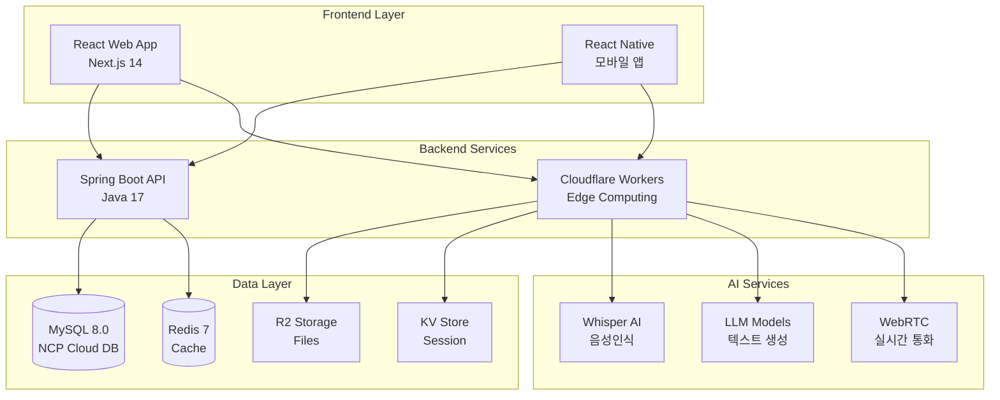
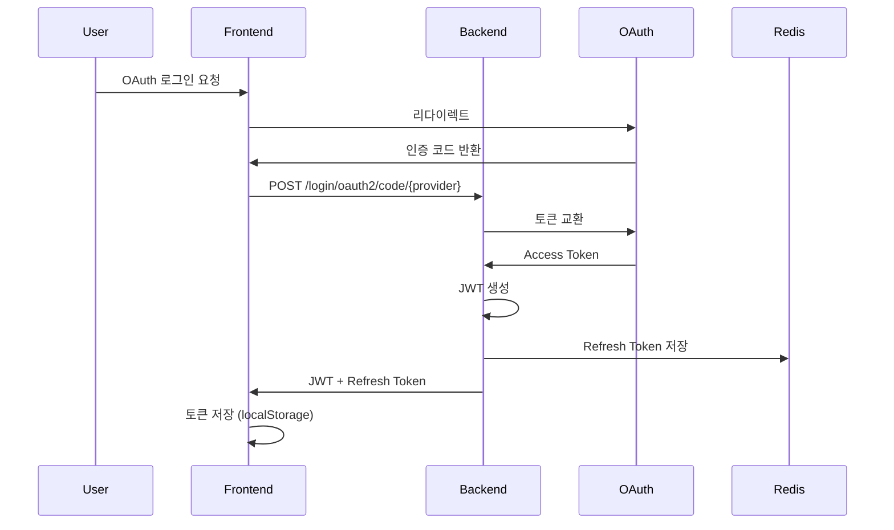
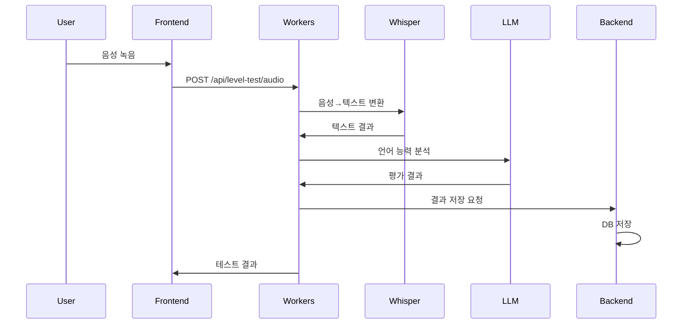
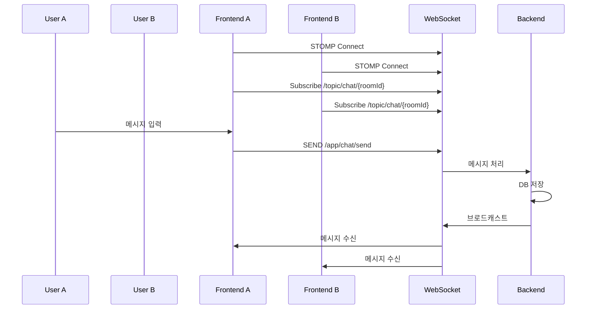
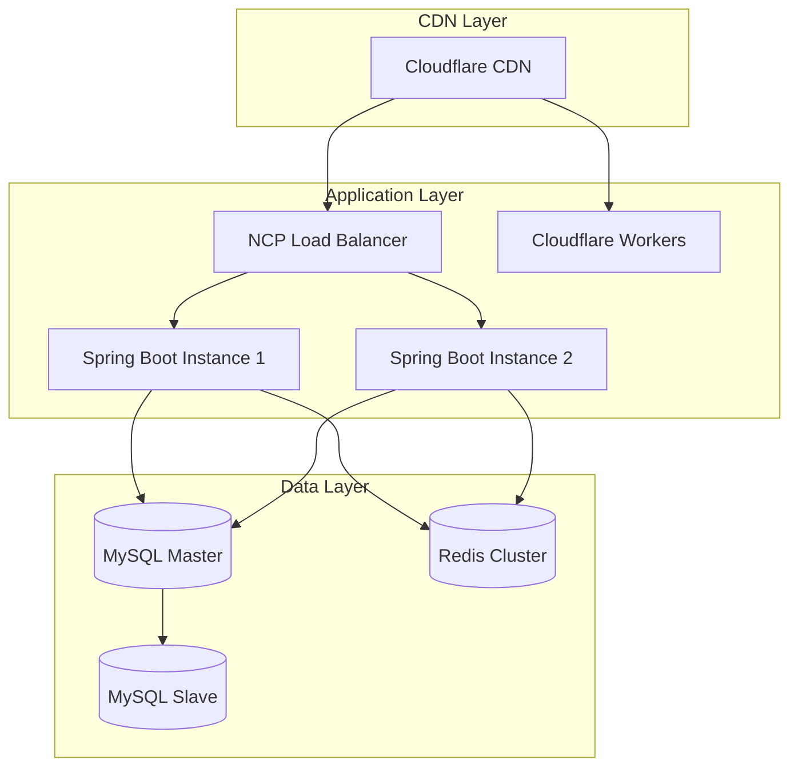

# 🏗️ STUDYMATE 통합 시스템 아키텍처

## 📅 문서 정보
- **버전**: 2.0
- **최종 업데이트**: 2025-09-10
- **작성자**: Architecture Team
- **목적**: STUDYMATE 전체 시스템 아키텍처 및 통합 구조

---

## 🎯 시스템 구성 개요

### 3-Tier 아키텍처 + AI Layer



---

## 🔗 서비스별 역할 분담

### 1. Spring Boot Backend (Main API Server)

#### 담당 도메인
- **사용자 관리**: OAuth 인증, 프로필, 권한
- **온보딩**: 학습 설정, 선호도, 스케줄
- **매칭 시스템**: 사용자 매칭 알고리즘
- **채팅**: 실시간 메시징 (WebSocket/STOMP)
- **세션 관리**: 학습 세션 예약 및 관리
- **알림**: 푸시 알림, 이메일 알림

#### 기술 스택
```yaml
Core:
  - Spring Boot 3.5.3
  - Java 17
  - Spring Security + JWT
  
Database:
  - MySQL 8.0 (주 데이터베이스)
  - Redis 7 (캐시 & 세션)
  
Communication:
  - REST API
  - WebSocket (STOMP)
  - OpenFeign (외부 API)
```

### 2. Cloudflare Workers (AI & Edge Services)

#### 담당 기능
- **레벨 테스트**: 음성 인식 기반 언어 능력 평가
- **AI 텍스트 생성**: 학습 콘텐츠 생성
- **실시간 통화**: WebRTC 시그널링 서버
- **파일 처리**: 이미지/음성 파일 저장 및 변환
- **Edge 캐싱**: 정적 콘텐츠 캐싱

#### Workers API 엔드포인트
```typescript
// 레벨 테스트
POST /api/level-test/audio     // 음성 제출
POST /api/level-test/analyze   // 결과 분석
GET  /api/level-test/result/:id // 결과 조회

// LLM 서비스
POST /api/llm/generate         // 텍스트 생성
POST /api/llm/chat            // 대화형 응답
POST /api/llm/feedback        // 피드백 생성

// WebRTC
POST /api/rtc/signal          // 시그널링
GET  /api/rtc/turn           // TURN 서버 정보

// 파일 업로드
POST /api/upload/image       // 이미지 업로드
POST /api/upload/audio       // 음성 업로드
GET  /api/files/:id         // 파일 다운로드
```

### 3. Frontend (React/Next.js)

#### 주요 구조
```
src/
├── app/                    # Next.js 14 App Router
│   ├── (auth)/            # 인증 관련 페이지
│   ├── (main)/            # 메인 서비스 페이지
│   └── api/               # API 라우트
├── components/            # 공통 컴포넌트
├── hooks/                # Custom Hooks
├── stores/               # Zustand 상태 관리
├── services/             # API 서비스
├── types/                # TypeScript 타입
└── utils/                # 유틸리티

workers/                   # Cloudflare Workers
├── src/
│   ├── handlers/        # API 핸들러
│   ├── services/        # 비즈니스 로직
│   └── utils/          # 유틸리티
```

---

## 📊 데이터 흐름

### 1. 사용자 인증 플로우



### 2. 레벨 테스트 플로우



### 3. 실시간 채팅 플로우



---

## 🔐 보안 아키텍처

### 인증/인가 체계

```yaml
Authentication:
  - OAuth 2.0 (Naver, Google)
  - JWT (Access + Refresh Token)
  - Spring Security Filter Chain

Authorization:
  - Role-based (USER, ADMIN)
  - Resource-based (Owner check)
  - API Rate Limiting

Data Security:
  - TLS 1.3 (전송 암호화)
  - BCrypt (비밀번호 해싱)
  - AES-256 (민감 데이터)
```

### API 게이트웨이 보안

```typescript
// CORS 설정
const corsOptions = {
  origin: [
    'https://languagemate.kr',
    'https://api.languagemate.kr',
    'http://localhost:3000' // 개발 환경
  ],
  credentials: true,
  allowedHeaders: ['Content-Type', 'Authorization'],
  methods: ['GET', 'POST', 'PUT', 'DELETE', 'OPTIONS']
};

// Rate Limiting
const rateLimiter = {
  general: '100 requests per minute',
  levelTest: '10 requests per hour',
  llm: '50 requests per hour'
};
```

---

## 🚀 배포 아키텍처

### 프로덕션 환경



### 인프라 구성

#### NCP (Naver Cloud Platform)
```yaml
VPC:
  - Name: studymate-vpc
  - CIDR: 10.0.0.0/16
  
Subnets:
  - Public: 10.0.1.0/24 (Load Balancer)
  - Private: 10.0.2.0/24 (Application)
  - Data: 10.0.3.0/24 (Database)

Servers:
  - Type: Standard (2 vCPU, 4GB RAM)
  - OS: Ubuntu 22.04
  - Auto-scaling: 2-4 instances

Database:
  - MySQL: Standard-g2 (4 vCPU, 16GB RAM)
  - Redis: Standard (2GB)
  
Storage:
  - Object Storage: 100GB
  - Backup: Daily snapshot
```

#### Cloudflare
```yaml
Workers:
  - Plan: Bundled (10M requests/month)
  - KV Storage: Unlimited namespaces
  - R2 Storage: 10GB
  - Durable Objects: WebRTC signaling

CDN:
  - Global Edge Network
  - DDoS Protection
  - WAF Rules
  - Cache Rules
```

---

## 📈 모니터링 & 관찰성

### 모니터링 스택

```yaml
Metrics:
  - Spring Boot Actuator
  - Prometheus
  - Grafana Dashboard

Logging:
  - ELK Stack (Elasticsearch, Logstash, Kibana)
  - Cloudflare Analytics
  - Application Logs (Log4j2)

Tracing:
  - Jaeger (분산 추적)
  - Spring Cloud Sleuth

Alerting:
  - PagerDuty
  - Slack Integration
  - Email Notifications
```

### 주요 메트릭

#### Application Metrics
- API Response Time (P50, P95, P99)
- Request Rate (req/sec)
- Error Rate (4xx, 5xx)
- Active Users
- WebSocket Connections

#### Infrastructure Metrics
- CPU Usage (< 70%)
- Memory Usage (< 80%)
- Disk I/O
- Network Throughput
- Database Connections

#### Business Metrics
- Daily Active Users (DAU)
- 매칭 성공률
- 평균 세션 시간
- 레벨 테스트 완료율

---

## 🔄 CI/CD 파이프라인

### Backend (Spring Boot)

```yaml
Pipeline:
  1. Code Push → GitHub
  2. GitHub Actions Trigger
  3. Build & Test (Gradle)
  4. Docker Image Build
  5. Push to Registry
  6. Deploy to NCP
  7. Health Check
  8. Rollback if Failed
```

### Frontend (Next.js)

```yaml
Pipeline:
  1. Code Push → GitHub
  2. Vercel Auto Deploy
  3. Preview Deployment
  4. E2E Tests (Playwright)
  5. Production Deploy
  6. Cache Invalidation
```

### Workers (Cloudflare)

```yaml
Pipeline:
  1. Code Push → GitHub
  2. Wrangler Build
  3. Deploy to Workers
  4. Gradual Rollout (10% → 50% → 100%)
  5. Monitor Error Rate
  6. Auto Rollback if Errors > Threshold
```

---

## 🎯 성능 목표

### SLA (Service Level Agreement)

| 메트릭 | 목표 | 현재 |
|--------|------|------|
| Uptime | 99.9% | 99.95% |
| API Response Time (P95) | < 200ms | 150ms |
| WebSocket Latency | < 50ms | 30ms |
| 레벨 테스트 처리 시간 | < 5s | 3.5s |
| 동시 접속자 | 10,000+ | 지원 |

### 확장성 계획

#### Phase 1 (현재)
- Users: 1,000
- Requests: 100K/day
- Storage: 100GB

#### Phase 2 (6개월)
- Users: 10,000
- Requests: 1M/day
- Storage: 1TB
- 추가: 
  - Database Read Replica
  - Redis Cluster
  - Multi-region CDN

#### Phase 3 (1년)
- Users: 100,000
- Requests: 10M/day
- Storage: 10TB
- 추가:
  - Microservices 전환
  - Kubernetes 오케스트레이션
  - Global Multi-region 배포

---

## 🔍 기술 부채 및 개선 계획

### 단기 (1-2개월)
- [ ] API 버전 관리 체계 구축
- [ ] 통합 테스트 커버리지 80% 달성
- [ ] WebSocket 재연결 로직 개선
- [ ] 에러 트래킹 시스템 구축

### 중기 (3-6개월)
- [ ] GraphQL 도입 검토
- [ ] 마이크로서비스 아키텍처 전환 준비
- [ ] Event-driven 아키텍처 도입
- [ ] 블루-그린 배포 자동화

### 장기 (6개월+)
- [ ] AI 모델 자체 호스팅
- [ ] 블록체인 기반 학습 인증
- [ ] AR/VR 학습 환경 지원
- [ ] 글로벌 확장 (다국어 지원)

---

*이 문서는 STUDYMATE의 전체 시스템 아키텍처를 통합적으로 설명합니다.*
*Backend, Frontend, Workers 모든 구성요소가 포함되어 있습니다.*