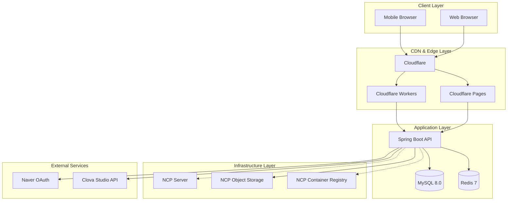
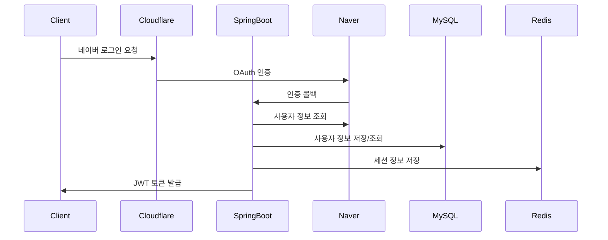
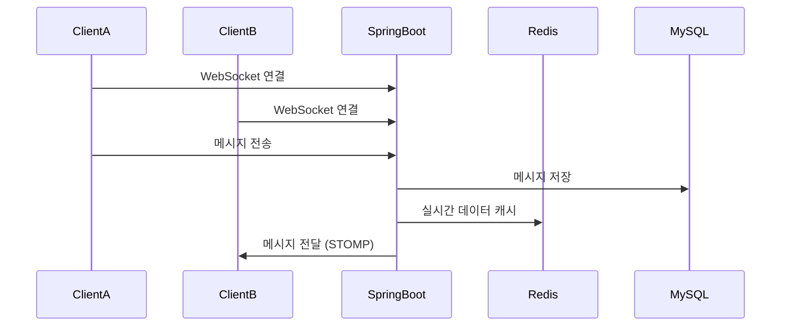
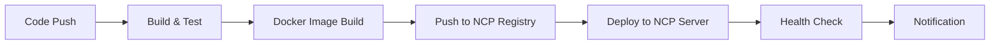
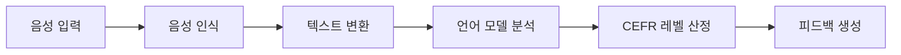
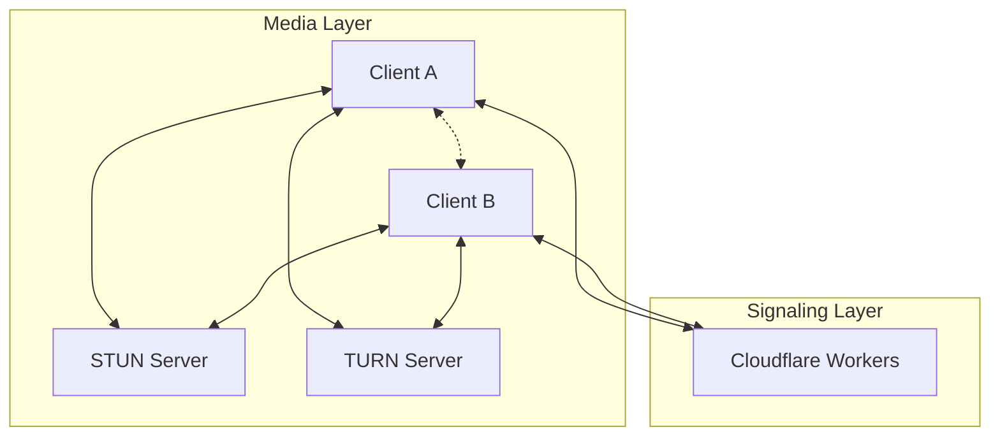

# 🏗️ STUDYMATE 시스템 아키텍처

## 📅 문서 정보
- **최종 업데이트**: 2025-08-27
- **작성자**: System Architecture Team
- **목적**: STUDYMATE 언어교환 플랫폼의 전체 시스템 아키텍처 및 기술 스택 소개

---

## 🎯 시스템 개요

STUDYMATE는 **AI 기반 언어교환 플랫폼**으로, 실시간 화상/음성 통화, 채팅, 레벨 테스트 등을 제공하는 종합적인 언어 학습 서비스입니다.

### 핵심 기능
- 🤖 **AI 레벨 테스트**: 음성 인식 기반 영어 실력 평가 (CEFR 기준)
- 🎥 **실시간 세션**: WebRTC 기반 1:1 화상/음성 통화
- 💬 **실시간 채팅**: WebSocket 기반 메시징 시스템
- 👥 **매칭 시스템**: 사용자 선호도 기반 언어교환 파트너 매칭
- 📊 **학습 관리**: 진도 추적, 통계 대시보드, 스케줄 관리

---

## 🏛️ 전체 시스템 아키텍처



---

## 🔧 기술 스택 상세

### Frontend Stack
| 구분 | 기술 | 버전 | 역할 |
|------|------|------|------|
| **Framework** | React | 19.1.0 | UI 라이브러리 |
| **Build Tool** | Vite | 7.0.4 | 빌드 도구 및 개발 서버 |
| **Styling** | Tailwind CSS | 4.1.11 | CSS 프레임워크 |
| **State Management** | Zustand | 5.0.6 | 전역 상태 관리 |
| **Routing** | React Router | 7.6.3 | 클라이언트 라우팅 |
| **HTTP Client** | Axios | 1.10.0 | API 통신 |
| **WebRTC** | Native WebRTC API | - | 실시간 미디어 통신 |
| **WebSocket** | STOMP.js | 2.3.3 | 실시간 메시징 |
| **Testing** | Playwright | 1.54.2 | E2E 테스트 |

### Backend Stack
| 구분 | 기술 | 버전 | 역할 |
|------|------|------|------|
| **Framework** | Spring Boot | 3.5.3 | 애플리케이션 프레임워크 |
| **Language** | Java | 17 | 백엔드 언어 |
| **Security** | Spring Security | - | 인증/인가 |
| **Database** | MySQL | 8.0 | 주 데이터베이스 |
| **Cache** | Redis | 7 | 캐싱 및 세션 저장소 |
| **ORM** | Spring Data JPA | - | 데이터 접근 계층 |
| **WebSocket** | Spring WebSocket | - | 실시간 통신 |
| **Documentation** | Swagger/OpenAPI | 3 | API 문서화 |
| **Containerization** | Docker | - | 애플리케이션 패키징 |

### Infrastructure Stack
| 구분 | 기술 | 역할 |
|------|------|------|
| **Frontend Hosting** | Cloudflare Pages | 정적 웹사이트 호스팅 |
| **Backend Hosting** | NCP Server (Ubuntu) | 애플리케이션 서버 |
| **Container Registry** | NCP Container Registry | Docker 이미지 저장소 |
| **Object Storage** | NCP Object Storage | 파일 저장소 (S3 호환) |
| **CDN** | Cloudflare CDN | 글로벌 콘텐츠 전송 |
| **SSL/DNS** | Cloudflare | SSL 인증서 및 DNS 관리 |
| **CI/CD** | GitHub Actions | 자동화된 배포 파이프라인 |

---

## 🌐 네트워크 아키텍처

### 도메인 구조
```
languagemate.kr (메인 도메인)
├── www.languagemate.kr → 프론트엔드 (Cloudflare Pages)
├── api.languagemate.kr → 백엔드 API (NCP Server)
└── admin.languagemate.kr → 관리자 패널 (예정)
```

### 트래픽 플로우
```
Client Request → Cloudflare Edge → Origin Server
                      ↓
              [WAF, Cache, CDN]
                      ↓
              Frontend (Pages) or Backend (NCP)
```

### 보안 계층
- **Cloudflare WAF**: DDoS 보호, 악성 트래픽 차단
- **SSL/TLS**: 전 구간 암호화 통신
- **JWT Authentication**: Stateless 토큰 기반 인증
- **CORS Policy**: 허용된 도메인만 API 접근 가능

---

## 🗂️ 데이터베이스 설계

### MySQL 스키마 구조
```sql
-- 핵심 테이블 구조
users                    -- 사용자 기본 정보
├── user_profiles       -- 프로필 상세 정보
├── onboard_languages   -- 온보딩: 언어 설정
├── onboard_interests   -- 온보딩: 관심사
├── onboard_partners    -- 온보딩: 파트너 선호도
├── onboard_schedules   -- 온보딩: 스케줄
├── level_tests         -- 레벨 테스트 결과
├── chat_rooms          -- 채팅방
├── chat_messages       -- 채팅 메시지
└── sessions           -- 화상/음성 세션
```

### Redis 데이터 구조
```
redis:
├── session:${sessionId}     -- 사용자 세션 정보
├── chat:${roomId}          -- 채팅방 임시 데이터
├── webrtc:${roomId}        -- WebRTC 시그널링 데이터
└── cache:${key}            -- 일반 캐시 데이터
```

---

## 🔄 데이터 플로우

### 1. 사용자 인증 플로우


### 2. 실시간 채팅 플로우


### 3. WebRTC 세션 플로우
```mermaid
sequenceDiagram
    participant ClientA
    participant ClientB
    participant CFWorkers
    participant SpringBoot
    
    ClientA->>CFWorkers: 시그널링 서버 연결
    ClientB->>CFWorkers: 시그널링 서버 연결
    ClientA->>CFWorkers: Offer SDP
    CFWorkers->>ClientB: Offer SDP 전달
    ClientB->>CFWorkers: Answer SDP
    CFWorkers->>ClientA: Answer SDP 전달
    ClientA<-->ClientB: P2P 미디어 스트림
```

---

## 📦 컨테이너화 및 배포

### Docker Architecture
```
STUDYMATE-SERVER/
├── docker-compose.prod.yml    -- 프로덕션 구성
├── docker-compose.local.yml   -- 로컬 개발 구성
├── Dockerfile                 -- Spring Boot 이미지
└── config/
    └── mysql/my.cnf          -- MySQL 최적화 설정
```

### 서비스 컴포지션
```yaml
services:
  app:          # Spring Boot Application
    ports: ["8080:8080"]
    depends_on: [db, redis]
    
  db:           # MySQL 8.0
    ports: ["3306:3306"]
    volumes: [mysql-data]
    
  redis:        # Redis 7
    ports: ["6379:6379"] 
    volumes: [redis-data]
    
  backup:       # 자동 백업 서비스
    schedule: "0 2 * * *"  # 매일 02:00
```

---

## 🚀 CI/CD 파이프라인

### GitHub Actions Workflow


### 배포 단계별 상세
1. **소스 코드 빌드**: Gradle bootJar
2. **Docker 이미지 빌드**: Multi-stage build
3. **이미지 푸시**: NCP Container Registry
4. **서버 배포**: Docker Compose 기반 무중단 배포
5. **헬스 체크**: 애플리케이션 상태 확인
6. **슬랙 알림**: 배포 결과 통지

---

## 🔍 모니터링 및 관측성

### Application Monitoring
- **Logging**: Logback + 구조화된 JSON 로그
- **Metrics**: Spring Boot Actuator 메트릭
- **Health Checks**: `/actuator/health` 엔드포인트
- **Performance**: JVM 메트릭, DB 커넥션 풀

### Infrastructure Monitoring
- **Server Metrics**: CPU, Memory, Disk, Network
- **Database Metrics**: Connection count, Query performance
- **Redis Metrics**: Memory usage, Hit ratio
- **Container Metrics**: Docker stats, Resource usage

### Error Tracking
- **Application Errors**: Spring Boot 글로벌 예외 처리
- **API Errors**: HTTP 상태 코드별 분류
- **Frontend Errors**: JavaScript 에러 추적 (예정)
- **Performance Issues**: Slow query 로그

---

## 📊 성능 및 확장성

### 현재 성능 지표
- **API 응답 시간**: 평균 < 200ms
- **WebSocket 연결**: 동시 1,000+ 연결 지원
- **Database**: 초당 1,000+ 쿼리 처리
- **File Upload**: 최대 10MB 파일 업로드

### 확장성 전략
#### 수직 확장 (Scale Up)
- 서버 리소스 증설 (CPU/Memory 추가)
- Database 성능 최적화 (인덱싱, 쿼리 튜닝)

#### 수평 확장 (Scale Out)
- Load Balancer 도입
- Database Read Replica 구성
- Redis Cluster 구성
- Microservice 아키텍처 전환 (장기 계획)

---

## 🔐 보안 아키텍처

### 인증/인가 체계
```
Client → JWT Token → Spring Security → Method-Level Authorization
   ↓
[OAuth Provider] → [Token Validation] → [Role-Based Access Control]
```

### 보안 조치
- **데이터 암호화**: 전송 중 (TLS), 저장 시 (DB Encryption)
- **SQL Injection 방지**: Prepared Statement 사용
- **XSS 방지**: Content Security Policy 헤더
- **CSRF 방지**: JWT 토큰 기반 Stateless 인증
- **Rate Limiting**: API 호출 빈도 제한 (Cloudflare)

---

## 🌟 특수 기능 아키텍처

### AI 레벨 테스트


### WebRTC 실시간 통신


---

## 🚦 장애 대응 및 복구

### 자동 복구 메커니즘
- **Container Restart**: Docker healthcheck 기반 자동 재시작
- **Database Failover**: MySQL 마스터-슬레이브 구성 (계획)
- **Cache Failover**: Redis Sentinel 구성 (계획)
- **Load Balancing**: 다중 서버 구성 시 자동 부하 분산

### 백업 전략
- **Database Backup**: 매일 자동 백업, 7일 보관
- **Redis Persistence**: AOF + RDB 백업
- **Application Backup**: Docker 이미지 버전 관리
- **Configuration Backup**: Git 기반 설정 관리

### 장애 복구 절차
1. **장애 감지**: 모니터링 시스템 알람
2. **즉시 대응**: 서비스 재시작, 트래픽 차단
3. **원인 분석**: 로그 분석, 메트릭 확인
4. **복구 실행**: 백업 복원, 서비스 재배포
5. **사후 검토**: 장애 보고서 작성, 개선 방안 수립

---

## 🔮 향후 로드맵

### 단기 계획 (3개월)
- [ ] Load Balancer 도입
- [ ] Database Read Replica 구성
- [ ] 모니터링 대시보드 구축
- [ ] 성능 최적화 (쿼리 튜닝, 캐싱 확대)

### 중기 계획 (6개월)
- [ ] Microservice 아키텍처 전환
- [ ] Kubernetes 도입
- [ ] ElasticSearch 로그 분석 시스템
- [ ] Redis Cluster 구성

### 장기 계획 (1년)
- [ ] Multi-region 배포
- [ ] AI 모델 자체 호스팅
- [ ] Real-time Analytics 시스템
- [ ] Mobile App 개발

---

## 📚 관련 문서

- [배포 가이드](./deployment-guide.md)
- [프론트엔드-백엔드 연동](./frontend-backend-integration.md)
- [NCP 인프라 구성](./ncp-infrastructure.md)
- [Docker Compose 설정](../docker-compose.prod.yml)
- [프론트엔드 아키텍처](../../STYDYMATE-CLIENT/docs/ARCHITECTURE.md)