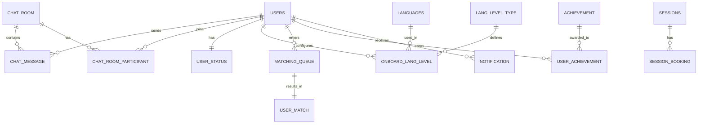

# 🗄️ 데이터베이스 스키마 설계 v2.0

## 📅 문서 정보
- **버전**: 2.0
- **최종 업데이트**: 2025-09-10
- **작성자**: Backend Development Team
- **목적**: STUDYMATE 실제 엔티티 기반 데이터베이스 스키마 문서

---

## 🏗️ 데이터베이스 아키텍처

### 기술 스택
- **주 데이터베이스**: MySQL 8.0 (NCP Cloud DB for MySQL)
- **캐시**: Redis 7 (NCP Cloud DB for Redis)
- **ORM**: Spring Data JPA + Hibernate
- **ID 생성 전략**: 
  - UUID: User 엔티티
  - IDENTITY: 대부분의 엔티티
  - 복합키: 온보딩 관련 매핑 테이블

### 설계 원칙
1. **정규화**: 3NF 적용으로 데이터 중복 최소화
2. **성능 최적화**: 자주 조회되는 컬럼 인덱싱
3. **확장성**: 도메인별 모듈화 구조
4. **일관성**: UPPER_CASE 테이블명 컨벤션

---

## 📊 도메인별 스키마

### 1. 👤 User 도메인

#### USERS 테이블
| 컬럼명 | 타입 | 제약조건 | 설명 |
|--------|------|----------|------|
| USER_ID | UUID | PK | 사용자 고유 식별자 |
| USER_IDENTITY | VARCHAR(255) | | OAuth 식별자 |
| EMAIL | VARCHAR(255) | UNIQUE | 이메일 주소 |
| NAME | VARCHAR(255) | | 사용자 실명 |
| ENGLISH_NAME | VARCHAR(255) | | 영어 이름 |
| PROFILE_IMAGE | VARCHAR(500) | | 프로필 이미지 URL |
| SELF_BIO | VARCHAR(1000) | | 자기소개 |
| BIRTHDAY | VARCHAR(20) | | 생일 (MM-DD) |
| BIRTHYEAR | VARCHAR(4) | | 출생년도 |
| GENDER | VARCHAR(20) | | 성별 (MALE/FEMALE/OTHER) |
| USER_DISABLE | BOOLEAN | NOT NULL | 계정 비활성화 여부 |
| IS_ONBOARDING_COMPLETED | BOOLEAN | NOT NULL | 온보딩 완료 여부 |
| LOCATION_ID | INT | FK | 위치 정보 |
| NATIVE_LANG_ID | INT | FK | 모국어 |
| LEARNING_EXPECTION | VARCHAR(50) | | 학습 기대사항 |
| PARTNER_GENDER | VARCHAR(20) | | 선호 파트너 성별 |
| COMMUNICATION_METHOD | VARCHAR(50) | | 선호 소통 방법 |
| DAILY_MINUTE | VARCHAR(20) | | 일일 학습 시간 |
| USER_IDENTITY_TYPE | VARCHAR(20) | | 인증 유형 (NAVER/GOOGLE) |
| USER_CREATED_AT | DATETIME | | 계정 생성 시간 |

#### LOCATIONS 테이블
| 컬럼명 | 타입 | 제약조건 | 설명 |
|--------|------|----------|------|
| LOCATION_ID | INT | PK, AUTO_INCREMENT | 위치 ID |
| COUNTRY | VARCHAR(100) | NOT NULL | 국가명 |
| CITY | VARCHAR(100) | | 도시명 |
| TIME_ZONE | VARCHAR(50) | | 시간대 |

#### USER_STATUS 테이블
| 컬럼명 | 타입 | 제약조건 | 설명 |
|--------|------|----------|------|
| STATUS_ID | BIGINT | PK, AUTO_INCREMENT | 상태 ID |
| USER_ID | UUID | FK, UNIQUE | 사용자 ID |
| ONLINE_STATUS | VARCHAR(20) | | 온라인 상태 |
| LAST_ACTIVE_AT | DATETIME | | 마지막 활동 시간 |
| STATUS_MESSAGE | VARCHAR(255) | | 상태 메시지 |

---

### 2. 💬 Chat 도메인

#### CHAT_ROOM 테이블
| 컬럼명 | 타입 | 제약조건 | 설명 |
|--------|------|----------|------|
| room_id | BIGINT | PK, AUTO_INCREMENT | 채팅방 ID |
| room_name | VARCHAR(255) | NOT NULL | 채팅방 이름 |
| room_type | VARCHAR(20) | NOT NULL | 채팅방 유형 (ONE_TO_ONE/GROUP) |
| is_public | BOOLEAN | NOT NULL | 공개 여부 |
| max_participants | INT | | 최대 참여자 수 |
| created_at | DATETIME | | 생성 시간 |
| updated_at | DATETIME | | 수정 시간 |

#### CHAT_MESSAGE 테이블
| 컬럼명 | 타입 | 제약조건 | 설명 |
|--------|------|----------|------|
| message_id | BIGINT | PK, AUTO_INCREMENT | 메시지 ID |
| room_id | BIGINT | FK, NOT NULL | 채팅방 ID |
| sender_id | UUID | FK, NOT NULL | 발신자 ID |
| content | TEXT | | 메시지 내용 |
| message_type | VARCHAR(20) | | 메시지 유형 (TEXT/IMAGE/FILE/SYSTEM) |
| is_edited | BOOLEAN | DEFAULT FALSE | 수정 여부 |
| created_at | DATETIME | | 전송 시간 |
| updated_at | DATETIME | | 수정 시간 |

#### CHAT_ROOM_PARTICIPANT 테이블
| 컬럼명 | 타입 | 제약조건 | 설명 |
|--------|------|----------|------|
| room_id | BIGINT | PK, FK | 채팅방 ID |
| user_id | UUID | PK, FK | 사용자 ID |
| joined_at | DATETIME | | 참여 시간 |
| last_read_at | DATETIME | | 마지막 읽은 시간 |
| is_active | BOOLEAN | DEFAULT TRUE | 활성 상태 |

#### MESSAGE_READ_STATUS 테이블
| 컬럼명 | 타입 | 제약조건 | 설명 |
|--------|------|----------|------|
| status_id | BIGINT | PK, AUTO_INCREMENT | 상태 ID |
| message_id | BIGINT | FK | 메시지 ID |
| user_id | UUID | FK | 사용자 ID |
| read_at | DATETIME | | 읽은 시간 |

---

### 3. 📝 Onboarding 도메인

#### LANGUAGES 테이블
| 컬럼명 | 타입 | 제약조건 | 설명 |
|--------|------|----------|------|
| LANG_ID | INT | PK, AUTO_INCREMENT | 언어 ID |
| LANG_NAME | VARCHAR(100) | NOT NULL | 언어명 |
| LANG_CODE | VARCHAR(10) | UNIQUE | 언어 코드 (ISO 639-1) |
| IS_ACTIVE | BOOLEAN | DEFAULT TRUE | 활성 상태 |

#### LANG_LEVEL_TYPE 테이블
| 컬럼명 | 타입 | 제약조건 | 설명 |
|--------|------|----------|------|
| LEVEL_ID | INT | PK, AUTO_INCREMENT | 레벨 ID |
| LEVEL_NAME | VARCHAR(50) | NOT NULL | 레벨명 (Beginner/Intermediate/Advanced) |
| LEVEL_CODE | VARCHAR(10) | UNIQUE | 레벨 코드 (A1/A2/B1/B2/C1/C2) |
| LEVEL_ORDER | INT | | 레벨 순서 |

#### ONBOARD_LANG_LEVEL 테이블 (복합키)
| 컬럼명 | 타입 | 제약조건 | 설명 |
|--------|------|----------|------|
| LANG_ID | INT | PK, FK | 언어 ID |
| USER_ID | UUID | PK, FK | 사용자 ID |
| CURRENT_LEVEL_ID | INT | FK | 현재 레벨 |
| TARGET_LEVEL_ID | INT | FK | 목표 레벨 |
| CREATED_AT | DATETIME | | 생성 시간 |

#### MOTIVATION 테이블
| 컬럼명 | 타입 | 제약조건 | 설명 |
|--------|------|----------|------|
| MOTIVATION_ID | INT | PK, AUTO_INCREMENT | 동기 ID |
| MOTIVATION_NAME | VARCHAR(100) | NOT NULL | 동기명 |
| MOTIVATION_DESC | VARCHAR(500) | | 설명 |

#### ONBOARD_MOTIVATION 테이블 (복합키)
| 컬럼명 | 타입 | 제약조건 | 설명 |
|--------|------|----------|------|
| MOTIVATION_ID | INT | PK, FK | 동기 ID |
| USER_ID | UUID | PK, FK | 사용자 ID |
| PRIORITY | INT | | 우선순위 |

#### LEARNING_STYLE 테이블
| 컬럼명 | 타입 | 제약조건 | 설명 |
|--------|------|----------|------|
| STYLE_ID | INT | PK, AUTO_INCREMENT | 스타일 ID |
| STYLE_NAME | VARCHAR(100) | NOT NULL | 스타일명 |
| STYLE_DESC | VARCHAR(500) | | 설명 |

#### ONBOARD_LEARNING_STYLE 테이블 (복합키)
| 컬럼명 | 타입 | 제약조건 | 설명 |
|--------|------|----------|------|
| STYLE_ID | INT | PK, FK | 스타일 ID |
| USER_ID | UUID | PK, FK | 사용자 ID |

#### SCHEDULE 테이블
| 컬럼명 | 타입 | 제약조건 | 설명 |
|--------|------|----------|------|
| SCHEDULE_ID | INT | PK, AUTO_INCREMENT | 일정 ID |
| DAY_OF_WEEK | VARCHAR(20) | NOT NULL | 요일 |
| TIME_SLOT | VARCHAR(50) | NOT NULL | 시간대 |

#### ONBOARD_SCHEDULE 테이블 (복합키)
| 컬럼명 | 타입 | 제약조건 | 설명 |
|--------|------|----------|------|
| SCHEDULE_ID | INT | PK, FK | 일정 ID |
| USER_ID | UUID | PK, FK | 사용자 ID |
| IS_AVAILABLE | BOOLEAN | DEFAULT TRUE | 가능 여부 |

---

### 4. 🤝 Matching 도메인

#### MATCHING_QUEUE 테이블
| 컬럼명 | 타입 | 제약조건 | 설명 |
|--------|------|----------|------|
| queue_id | BIGINT | PK, AUTO_INCREMENT | 큐 ID |
| user_id | UUID | FK, UNIQUE | 사용자 ID |
| status | VARCHAR(20) | NOT NULL | 상태 (WAITING/MATCHED/EXPIRED) |
| priority_score | INT | | 우선순위 점수 |
| created_at | DATETIME | | 대기 시작 시간 |
| matched_at | DATETIME | | 매칭 시간 |

#### USER_MATCH 테이블
| 컬럼명 | 타입 | 제약조건 | 설명 |
|--------|------|----------|------|
| match_id | BIGINT | PK, AUTO_INCREMENT | 매칭 ID |
| user1_id | UUID | FK | 사용자1 ID |
| user2_id | UUID | FK | 사용자2 ID |
| match_score | DECIMAL(5,2) | | 매칭 점수 |
| matched_at | DATETIME | | 매칭 시간 |
| status | VARCHAR(20) | | 상태 (ACTIVE/ENDED) |

#### MATCHING_REQUEST 테이블
| 컬럼명 | 타입 | 제약조건 | 설명 |
|--------|------|----------|------|
| request_id | BIGINT | PK, AUTO_INCREMENT | 요청 ID |
| requester_id | UUID | FK | 요청자 ID |
| target_lang_id | INT | FK | 대상 언어 |
| preferred_level | VARCHAR(20) | | 선호 레벨 |
| created_at | DATETIME | | 요청 시간 |

---

### 5. 📚 Session 도메인

#### SESSIONS 테이블
| 컬럼명 | 타입 | 제약조건 | 설명 |
|--------|------|----------|------|
| session_id | BIGINT | PK, AUTO_INCREMENT | 세션 ID |
| title | VARCHAR(255) | NOT NULL | 세션 제목 |
| description | TEXT | | 세션 설명 |
| session_type | VARCHAR(20) | | 세션 유형 (ONE_TO_ONE/GROUP) |
| language_id | INT | FK | 학습 언어 |
| level_id | INT | FK | 레벨 |
| scheduled_at | DATETIME | | 예정 시간 |
| duration_minutes | INT | | 지속 시간(분) |
| status | VARCHAR(20) | | 상태 (SCHEDULED/IN_PROGRESS/COMPLETED/CANCELLED) |
| created_by | UUID | FK | 생성자 ID |
| created_at | DATETIME | | 생성 시간 |

#### SESSION_BOOKING 테이블
| 컬럼명 | 타입 | 제약조건 | 설명 |
|--------|------|----------|------|
| booking_id | BIGINT | PK, AUTO_INCREMENT | 예약 ID |
| session_id | BIGINT | FK | 세션 ID |
| user_id | UUID | FK | 사용자 ID |
| booking_status | VARCHAR(20) | | 예약 상태 |
| booked_at | DATETIME | | 예약 시간 |

---

### 6. 🏆 Achievement 도메인

#### ACHIEVEMENT 테이블
| 컬럼명 | 타입 | 제약조건 | 설명 |
|--------|------|----------|------|
| achievement_id | BIGINT | PK, AUTO_INCREMENT | 업적 ID |
| name | VARCHAR(255) | NOT NULL | 업적명 |
| description | TEXT | | 설명 |
| icon_url | VARCHAR(500) | | 아이콘 URL |
| points | INT | | 포인트 |
| category | VARCHAR(50) | | 카테고리 |

#### USER_ACHIEVEMENT 테이블
| 컬럼명 | 타입 | 제약조건 | 설명 |
|--------|------|----------|------|
| user_achievement_id | BIGINT | PK, AUTO_INCREMENT | ID |
| user_id | UUID | FK | 사용자 ID |
| achievement_id | BIGINT | FK | 업적 ID |
| earned_at | DATETIME | | 획득 시간 |
| progress | INT | | 진행률 |

---

### 7. 🔔 Notification 도메인

#### NOTIFICATION 테이블
| 컬럼명 | 타입 | 제약조건 | 설명 |
|--------|------|----------|------|
| notification_id | BIGINT | PK, AUTO_INCREMENT | 알림 ID |
| user_id | UUID | FK | 사용자 ID |
| type | VARCHAR(50) | | 알림 유형 |
| title | VARCHAR(255) | | 제목 |
| content | TEXT | | 내용 |
| is_read | BOOLEAN | DEFAULT FALSE | 읽음 여부 |
| created_at | DATETIME | | 생성 시간 |
| read_at | DATETIME | | 읽은 시간 |

#### NOTIFICATION_PREFERENCE 테이블
| 컬럼명 | 타입 | 제약조건 | 설명 |
|--------|------|----------|------|
| preference_id | BIGINT | PK, AUTO_INCREMENT | 설정 ID |
| user_id | UUID | FK, UNIQUE | 사용자 ID |
| push_enabled | BOOLEAN | DEFAULT TRUE | 푸시 알림 |
| email_enabled | BOOLEAN | DEFAULT TRUE | 이메일 알림 |
| sms_enabled | BOOLEAN | DEFAULT FALSE | SMS 알림 |
| quiet_hours_start | TIME | | 방해금지 시작 |
| quiet_hours_end | TIME | | 방해금지 종료 |

---

## 🔐 Redis 캐시 구조

### RefreshToken
```json
{
  "key": "refresh_token:{userId}",
  "value": {
    "token": "jwt_refresh_token_string",
    "expiresAt": "2025-09-17T12:00:00"
  },
  "ttl": 604800 // 7일
}
```

### Session Cache
```json
{
  "key": "session:{sessionId}",
  "value": {
    "userId": "uuid",
    "loginTime": "2025-09-10T10:00:00",
    "lastActivity": "2025-09-10T11:30:00"
  },
  "ttl": 3600 // 1시간
}
```

### Matching Queue Cache
```json
{
  "key": "matching:queue",
  "value": [
    {
      "userId": "uuid",
      "priority": 100,
      "waitingSince": "2025-09-10T11:00:00"
    }
  ]
}
```

---

## 📈 인덱스 전략

### 성능 최적화 인덱스
```sql
-- 사용자 검색 최적화
CREATE INDEX idx_users_email ON USERS(EMAIL);
CREATE INDEX idx_users_location ON USERS(LOCATION_ID);
CREATE INDEX idx_users_native_lang ON USERS(NATIVE_LANG_ID);

-- 채팅 메시지 조회 최적화
CREATE INDEX idx_chat_message_room ON CHAT_MESSAGE(room_id, created_at DESC);
CREATE INDEX idx_chat_message_sender ON CHAT_MESSAGE(sender_id);

-- 매칭 큐 최적화
CREATE INDEX idx_matching_queue_status ON MATCHING_QUEUE(status, priority_score DESC);

-- 세션 조회 최적화
CREATE INDEX idx_sessions_scheduled ON SESSIONS(scheduled_at, status);
CREATE INDEX idx_sessions_creator ON SESSIONS(created_by);

-- 알림 조회 최적화
CREATE INDEX idx_notification_user_unread ON NOTIFICATION(user_id, is_read, created_at DESC);
```

---

## 🔄 마이그레이션 전략

### Flyway 마이그레이션 스크립트
```sql
-- V1__Initial_Schema.sql
-- 기본 테이블 생성

-- V2__Add_Indexes.sql
-- 인덱스 추가

-- V3__Add_Constraints.sql
-- 외래키 제약조건 추가
```

---

## 📊 ERD (Entity Relationship Diagram)



---

## 🚀 향후 개선 계획

### 단기 (1-2개월)
- [ ] 모든 테이블에 created_at, updated_at 컬럼 추가
- [ ] 소프트 삭제 패턴 적용 (deleted_at 컬럼)
- [ ] 복합 인덱스 최적화

### 중기 (3-6개월)
- [ ] 파티셔닝 전략 수립 (채팅 메시지, 알림)
- [ ] 읽기 전용 복제본 구성
- [ ] 캐싱 전략 고도화

### 장기 (6개월+)
- [ ] 샤딩 전략 검토
- [ ] NoSQL 도입 검토 (채팅 메시지)
- [ ] 데이터 아카이빙 정책 수립

---

*이 문서는 실제 Spring JPA 엔티티 구조를 기반으로 작성되었습니다.*
*EntitySchemaAnalyzer v1.0을 통해 검증된 스키마입니다.*