# 🗄️ 데이터베이스 스키마 설계

## 📅 문서 정보
- **최종 업데이트**: 2025-08-27
- **작성자**: Backend Development Team
- **목적**: STUDYMATE 데이터베이스 스키마 및 ERD

---

## 🏗️ 데이터베이스 구조 개요

### 사용 기술
- **주 데이터베이스**: MySQL 8.0 (Docker 컨테이너)
- **캐시**: Redis 7 (Docker 컨테이너)
- **ORM**: Spring Data JPA + Hibernate
- **마이그레이션**: Flyway (계획)

### 설계 원칙
1. **정규화**: 3NF까지 정규화하여 데이터 중복 최소화
2. **확장성**: 향후 기능 확장을 고려한 유연한 구조
3. **성능**: 자주 조회되는 컬럼에 인덱스 설정
4. **일관성**: 일관된 네이밍 컨벤션 적용

---

## 📊 ERD (Entity Relationship Diagram)

```mermaid
erDiagram
    USERS {
        varchar(36) id PK "UUID"
        varchar(255) email UK
        varchar(255) name
        varchar(255) english_name
        varchar(255) profile_image_url
        enum gender_type
        text self_bio
        int birth_year
        varchar(10) birth_day
        bigint location_id FK
        datetime created_at
        datetime updated_at
    }
    
    LOCATIONS {
        bigint id PK
        varchar(255) name
        varchar(50) code
        datetime created_at
        datetime updated_at
    }
    
    ONBOARD_LANGUAGES {
        varchar(36) user_id PK,FK
        bigint language_id PK,FK
        bigint level_id FK
        datetime created_at
    }
    
    LANGUAGES {
        bigint id PK
        varchar(255) name
        varchar(10) code
        boolean is_active
    }
    
    LANGUAGE_LEVELS {
        bigint id PK
        varchar(50) level_name
        varchar(10) level_code
        int level_order
    }
    
    ONBOARD_INTERESTS {
        varchar(36) user_id PK,FK
        bigint motivation_id PK,FK
        datetime created_at
    }
    
    MOTIVATIONS {
        bigint id PK
        varchar(255) name
        varchar(255) description
        boolean is_active
    }
    
    ONBOARD_PARTNERS {
        varchar(36) user_id PK,FK
        bigint partner_preference_id PK,FK
        datetime created_at
    }
    
    PARTNER_PREFERENCES {
        bigint id PK
        enum preference_type
        varchar(255) preference_value
        varchar(255) display_name
    }
    
    ONBOARD_SCHEDULES {
        varchar(36) user_id PK,FK
        enum day_of_week PK
        varchar(20) time_slot PK
        datetime created_at
    }
    
    LEVEL_TESTS {
        varchar(36) id PK "UUID"
        varchar(36) user_id FK
        enum test_status
        json questions
        json responses
        json analysis_result
        varchar(10) overall_level
        int pronunciation_score
        int fluency_score
        int vocabulary_score
        int grammar_score
        text feedback
        datetime started_at
        datetime completed_at
        datetime created_at
    }
    
    CHAT_ROOMS {
        bigint id PK
        varchar(255) room_name
        enum room_type
        json metadata
        datetime created_at
        datetime updated_at
    }
    
    CHAT_PARTICIPANTS {
        bigint room_id PK,FK
        varchar(36) user_id PK,FK
        enum participant_role
        datetime joined_at
        datetime last_read_at
    }
    
    CHAT_MESSAGES {
        bigint id PK
        bigint room_id FK
        varchar(36) sender_id FK
        enum message_type
        text content
        varchar(255) file_url
        json metadata
        boolean is_deleted
        datetime created_at
        datetime updated_at
    }
    
    SESSIONS {
        varchar(36) id PK "UUID"
        varchar(36) host_id FK
        enum session_type
        varchar(255) title
        text description
        datetime scheduled_time
        int duration_minutes
        enum session_status
        json webrtc_config
        datetime created_at
        datetime updated_at
    }
    
    SESSION_PARTICIPANTS {
        varchar(36) session_id PK,FK
        varchar(36) user_id PK,FK
        enum participant_status
        datetime joined_at
        datetime left_at
    }

    %% Relationships
    USERS ||--|| LOCATIONS : belongs_to
    USERS ||--o{ ONBOARD_LANGUAGES : has_many
    USERS ||--o{ ONBOARD_INTERESTS : has_many
    USERS ||--o{ ONBOARD_PARTNERS : has_many
    USERS ||--o{ ONBOARD_SCHEDULES : has_many
    USERS ||--o{ LEVEL_TESTS : has_many
    USERS ||--o{ CHAT_PARTICIPANTS : has_many
    USERS ||--o{ CHAT_MESSAGES : sends
    USERS ||--o{ SESSIONS : hosts
    USERS ||--o{ SESSION_PARTICIPANTS : participates
    
    LANGUAGES ||--o{ ONBOARD_LANGUAGES : has_many
    LANGUAGE_LEVELS ||--o{ ONBOARD_LANGUAGES : has_many
    MOTIVATIONS ||--o{ ONBOARD_INTERESTS : has_many
    PARTNER_PREFERENCES ||--o{ ONBOARD_PARTNERS : has_many
    
    CHAT_ROOMS ||--o{ CHAT_PARTICIPANTS : has_many
    CHAT_ROOMS ||--o{ CHAT_MESSAGES : contains
    
    SESSIONS ||--o{ SESSION_PARTICIPANTS : has_many
    
    ACHIEVEMENTS {
        bigint achievement_id PK
        varchar(100) achievement_key UK
        varchar(200) title
        text description
        enum category
        enum type
        enum tier
        int target_value
        varchar(50) target_unit
        int xp_reward
        varchar(500) badge_icon_url
        varchar(10) badge_color
        boolean is_active
        boolean is_hidden
        int sort_order
        bigint prerequisite_achievement_id FK
        datetime created_at
        datetime updated_at
    }
    
    USER_ACHIEVEMENTS {
        bigint user_achievement_id PK
        varchar(36) user_id FK
        bigint achievement_id FK
        int current_progress
        boolean is_completed
        datetime completed_at
        boolean is_reward_claimed
        datetime reward_claimed_at
        datetime created_at
        datetime updated_at
    }
    
    USERS ||--o{ USER_ACHIEVEMENTS : earns
    ACHIEVEMENTS ||--o{ USER_ACHIEVEMENTS : granted_to
    ACHIEVEMENTS ||--o{ ACHIEVEMENTS : prerequisite_for
    
    NOTIFICATIONS {
        bigint notification_id PK
        varchar(36) user_id FK
        enum type
        varchar(200) title
        text content
        varchar(500) action_url
        json action_data
        varchar(500) image_url
        varchar(500) icon_url
        enum status
        int priority
        varchar(50) category
        datetime scheduled_at
        datetime sent_at
        datetime read_at
        datetime expires_at
        boolean is_persistent
        varchar(255) sender_user_id
        varchar(100) template_id
        json template_variables
        varchar(100) delivery_channels
        boolean push_sent
        boolean email_sent
        boolean sms_sent
        datetime created_at
        datetime updated_at
    }
    
    NOTIFICATION_PREFERENCES {
        bigint preference_id PK
        varchar(36) user_id UK,FK
        boolean notifications_enabled
        boolean push_enabled
        boolean email_enabled
        boolean sms_enabled
        boolean session_notifications
        boolean session_reminders
        boolean matching_notifications
        boolean chat_notifications
        boolean level_test_notifications
        boolean system_notifications
        boolean marketing_notifications
        boolean quiet_hours_enabled
        varchar(5) quiet_hours_start
        varchar(5) quiet_hours_end
        varchar(50) timezone
        varchar(10) notification_language
        boolean digest_enabled
        varchar(20) digest_frequency
        varchar(5) digest_time
        datetime created_at
        datetime updated_at
    }
    
    USERS ||--o{ NOTIFICATIONS : receives
    USERS ||--|| NOTIFICATION_PREFERENCES : has
```



---

## 📋 테이블 상세 스키마

### 1. 사용자 관리 테이블

#### users (사용자 기본 정보)
| 컬럼명 | 데이터 타입 | 제약조건 | 설명 |
|--------|-------------|----------|------|
| `id` | VARCHAR(36) | PK | UUID 형태의 사용자 식별자 |
| `email` | VARCHAR(255) | UK, NOT NULL | 이메일 (소셜 로그인용) |
| `name` | VARCHAR(255) | NOT NULL | 사용자 이름 |
| `english_name` | VARCHAR(255) | NULL | 영어 이름 |
| `profile_image_url` | VARCHAR(255) | NULL | 프로필 이미지 URL |
| `gender_type` | ENUM | NULL | MALE, FEMALE, OTHER |
| `self_bio` | TEXT | NULL | 자기소개 |
| `birth_year` | INT | NULL | 출생연도 |
| `birth_day` | VARCHAR(10) | NULL | 생일 (MM-DD) |
| `location_id` | BIGINT | FK | 위치 정보 참조 |
| `created_at` | DATETIME | DEFAULT NOW() | 생성일시 |
| `updated_at` | DATETIME | ON UPDATE NOW() | 수정일시 |

**인덱스:**
```sql
CREATE INDEX idx_users_email ON users(email);
CREATE INDEX idx_users_location ON users(location_id);
```

#### locations (위치 정보)
| 컬럼명 | 데이터 타입 | 제약조건 | 설명 |
|--------|-------------|----------|------|
| `id` | BIGINT | PK, AUTO_INCREMENT | 위치 식별자 |
| `name` | VARCHAR(255) | NOT NULL | 위치명 (서울특별시) |
| `code` | VARCHAR(50) | UK, NOT NULL | 위치 코드 (SEOUL) |
| `created_at` | DATETIME | DEFAULT NOW() | 생성일시 |
| `updated_at` | DATETIME | ON UPDATE NOW() | 수정일시 |

### 2. 온보딩 관련 테이블

#### onboard_languages (언어 설정)
| 컬럼명 | 데이터 타입 | 제약조건 | 설명 |
|--------|-------------|----------|------|
| `user_id` | VARCHAR(36) | PK, FK | 사용자 ID |
| `language_id` | BIGINT | PK, FK | 언어 ID |
| `level_id` | BIGINT | FK | 언어 레벨 ID |
| `created_at` | DATETIME | DEFAULT NOW() | 생성일시 |

**복합키:** `(user_id, language_id)`

#### languages (언어 마스터)
| 컬럼명 | 데이터 타입 | 제약조건 | 설명 |
|--------|-------------|----------|------|
| `id` | BIGINT | PK, AUTO_INCREMENT | 언어 식별자 |
| `name` | VARCHAR(255) | NOT NULL | 언어명 (English) |
| `code` | VARCHAR(10) | UK, NOT NULL | 언어 코드 (EN) |
| `is_active` | BOOLEAN | DEFAULT TRUE | 활성화 여부 |

**초기 데이터:**
```sql
INSERT INTO languages (name, code) VALUES 
('English', 'EN'),
('Korean', 'KO'),
('Japanese', 'JA'),
('Chinese', 'ZH');
```

#### language_levels (언어 레벨)
| 컬럼명 | 데이터 타입 | 제약조건 | 설명 |
|--------|-------------|----------|------|
| `id` | BIGINT | PK, AUTO_INCREMENT | 레벨 식별자 |
| `level_name` | VARCHAR(50) | NOT NULL | 레벨명 (Beginner) |
| `level_code` | VARCHAR(10) | UK, NOT NULL | CEFR 코드 (A1) |
| `level_order` | INT | NOT NULL | 정렬 순서 |

**초기 데이터:**
```sql
INSERT INTO language_levels (level_name, level_code, level_order) VALUES 
('Beginner', 'A1', 1),
('Elementary', 'A2', 2),
('Intermediate', 'B1', 3),
('Upper Intermediate', 'B2', 4),
('Advanced', 'C1', 5),
('Proficient', 'C2', 6);
```

### 3. 채팅 관련 테이블

#### chat_rooms (채팅방)
| 컬럼명 | 데이터 타입 | 제약조건 | 설명 |
|--------|-------------|----------|------|
| `id` | BIGINT | PK, AUTO_INCREMENT | 채팅방 ID |
| `room_name` | VARCHAR(255) | NOT NULL | 채팅방 이름 |
| `room_type` | ENUM | NOT NULL | DIRECT, GROUP |
| `metadata` | JSON | NULL | 추가 메타데이터 |
| `created_at` | DATETIME | DEFAULT NOW() | 생성일시 |
| `updated_at` | DATETIME | ON UPDATE NOW() | 수정일시 |

#### chat_messages (채팅 메시지)
| 컬럼명 | 데이터 타입 | 제약조건 | 설명 |
|--------|-------------|----------|------|
| `id` | BIGINT | PK, AUTO_INCREMENT | 메시지 ID |
| `room_id` | BIGINT | FK, NOT NULL | 채팅방 ID |
| `sender_id` | VARCHAR(36) | FK, NOT NULL | 발신자 ID (사용자 UUID) |
| `message_type` | ENUM | NOT NULL | TEXT, IMAGE, VOICE, FILE |
| `content` | TEXT | NULL | 메시지 내용 |
| `file_url` | VARCHAR(255) | NULL | 첨부파일 URL |
| `metadata` | JSON | NULL | 추가 메타데이터 |
| `is_deleted` | BOOLEAN | DEFAULT FALSE | 삭제 여부 |
| `created_at` | DATETIME | DEFAULT NOW() | 생성일시 |
| `updated_at` | DATETIME | ON UPDATE NOW() | 수정일시 |

**인덱스:**
```sql
CREATE INDEX idx_chat_messages_room_created ON chat_messages(room_id, created_at DESC);
CREATE INDEX idx_chat_messages_sender ON chat_messages(sender_id);
```

### 4. 세션 관리 테이블

#### sessions (화상/음성 세션)
| 컬럼명 | 데이터 타입 | 제약조건 | 설명 |
|--------|-------------|----------|------|
| `id` | VARCHAR(36) | PK | UUID 형태의 세션 ID |
| `host_id` | VARCHAR(36) | FK, NOT NULL | 호스트 사용자 ID |
| `session_type` | ENUM | NOT NULL | VIDEO, AUDIO |
| `title` | VARCHAR(255) | NOT NULL | 세션 제목 |
| `description` | TEXT | NULL | 세션 설명 |
| `scheduled_time` | DATETIME | NOT NULL | 예정 시간 |
| `duration_minutes` | INT | DEFAULT 60 | 예상 소요시간 |
| `session_status` | ENUM | DEFAULT 'SCHEDULED' | SCHEDULED, ACTIVE, COMPLETED, CANCELLED |
| `webrtc_config` | JSON | NULL | WebRTC 설정 |
| `created_at` | DATETIME | DEFAULT NOW() | 생성일시 |
| `updated_at` | DATETIME | ON UPDATE NOW() | 수정일시 |

### 5. 레벨 테스트 테이블

#### level_tests (AI 레벨 테스트)
| 컬럼명 | 데이터 타입 | 제약조건 | 설명 |
|--------|-------------|----------|------|
| `id` | VARCHAR(36) | PK | UUID 형태의 테스트 ID |
| `user_id` | VARCHAR(36) | FK, NOT NULL | 사용자 ID |
| `test_status` | ENUM | DEFAULT 'STARTED' | STARTED, COMPLETED, FAILED |
| `questions` | JSON | NULL | 문제 목록 |
| `responses` | JSON | NULL | 사용자 답변 |
| `analysis_result` | JSON | NULL | AI 분석 결과 |
| `overall_level` | VARCHAR(10) | NULL | 전체 레벨 (B2) |
| `pronunciation_score` | INT | NULL | 발음 점수 (0-100) |
| `fluency_score` | INT | NULL | 유창성 점수 |
| `vocabulary_score` | INT | NULL | 어휘 점수 |
| `grammar_score` | INT | NULL | 문법 점수 |
| `feedback` | TEXT | NULL | 피드백 내용 |
| `started_at` | DATETIME | NULL | 테스트 시작 시간 |
| `completed_at` | DATETIME | NULL | 테스트 완료 시간 |
| `created_at` | DATETIME | DEFAULT NOW() | 생성일시 |

**인덱스:**
```sql
CREATE INDEX idx_level_tests_user_created ON level_tests(user_id, created_at DESC);
```

### 6. 성취 시스템 테이블

#### achievements (성취/업적 마스터)
| 컬럼명 | 데이터 타입 | 제약조건 | 설명 |
|--------|-------------|----------|------|
| `achievement_id` | BIGINT | PK, AUTO_INCREMENT | 성취 식별자 |
| `achievement_key` | VARCHAR(100) | UK, NOT NULL | 성취 고유키 (FIRST_SESSION) |
| `title` | VARCHAR(200) | NOT NULL | 성취 제목 |
| `description` | TEXT | NULL | 성취 설명 |
| `category` | ENUM | NOT NULL | LEARNING, SOCIAL, ENGAGEMENT, SKILL, TIME, MILESTONE, SPECIAL |
| `type` | ENUM | NOT NULL | COUNT, STREAK, ACCUMULATE, THRESHOLD, MILESTONE, COMBINATION |
| `tier` | ENUM | NOT NULL | BRONZE, SILVER, GOLD, PLATINUM, DIAMOND, LEGENDARY |
| `target_value` | INT | NULL | 목표값 (10회, 7일 등) |
| `target_unit` | VARCHAR(50) | NULL | 목표 단위 (sessions, days, points) |
| `xp_reward` | INT | NULL | 경험치 보상 |
| `badge_icon_url` | VARCHAR(500) | NULL | 배지 아이콘 URL |
| `badge_color` | VARCHAR(10) | NULL | 배지 색상 코드 |
| `is_active` | BOOLEAN | DEFAULT TRUE | 활성화 여부 |
| `is_hidden` | BOOLEAN | DEFAULT FALSE | 숨김 여부 (달성 전까지) |
| `sort_order` | INT | NULL | 정렬 순서 |
| `prerequisite_achievement_id` | BIGINT | FK | 선행 성취 조건 |
| `created_at` | DATETIME | DEFAULT NOW() | 생성일시 |
| `updated_at` | DATETIME | ON UPDATE NOW() | 수정일시 |

**인덱스:**
```sql
CREATE INDEX idx_achievements_category_active ON achievements(category, is_active);
CREATE INDEX idx_achievements_tier ON achievements(tier);
```

#### user_achievements (사용자 성취 진행도)
| 컬럼명 | 데이터 타입 | 제약조건 | 설명 |
|--------|-------------|----------|------|
| `user_achievement_id` | BIGINT | PK, AUTO_INCREMENT | 사용자 성취 식별자 |
| `user_id` | VARCHAR(36) | FK, NOT NULL | 사용자 ID |
| `achievement_id` | BIGINT | FK, NOT NULL | 성취 ID |
| `current_progress` | INT | DEFAULT 0 | 현재 진행도 |
| `is_completed` | BOOLEAN | DEFAULT FALSE | 달성 여부 |
| `completed_at` | DATETIME | NULL | 달성 일시 |
| `is_reward_claimed` | BOOLEAN | DEFAULT FALSE | 보상 수령 여부 |
| `reward_claimed_at` | DATETIME | NULL | 보상 수령 일시 |
| `created_at` | DATETIME | DEFAULT NOW() | 생성일시 |
| `updated_at` | DATETIME | ON UPDATE NOW() | 수정일시 |

**유니크 제약조건:**
```sql
ALTER TABLE user_achievements ADD UNIQUE KEY uk_user_achievement (user_id, achievement_id);
```

**인덱스:**
```sql
CREATE INDEX idx_user_achievements_user_completed ON user_achievements(user_id, is_completed);
CREATE INDEX idx_user_achievements_completed_at ON user_achievements(completed_at);
```

**초기 성취 데이터 예시:**
```sql
INSERT INTO achievements (achievement_key, title, description, category, type, tier, target_value, target_unit, xp_reward, sort_order) VALUES 
('FIRST_SESSION', '첫 대화', '첫 번째 언어교환 세션을 완료하세요', 'MILESTONE', 'COUNT', 'BRONZE', 1, 'sessions', 50, 1),
('WEEK_STREAK', '일주일 연속', '7일 연속으로 언어교환을 하세요', 'ENGAGEMENT', 'STREAK', 'SILVER', 7, 'days', 200, 2),
('SESSION_MASTER', '세션 마스터', '총 100회의 세션을 완료하세요', 'LEARNING', 'COUNT', 'GOLD', 100, 'sessions', 1000, 3),
('EARLY_BIRD', '이른 새', '오전 8시 이전에 세션을 시작하세요', 'SPECIAL', 'MILESTONE', 'BRONZE', 1, 'early_sessions', 100, 4),
('SOCIAL_BUTTERFLY', '소셜 나비', '10명의 다른 파트너와 대화하세요', 'SOCIAL', 'COUNT', 'SILVER', 10, 'partners', 300, 5);
```

---

## 🔧 데이터베이스 설정

### MySQL 설정 (my.cnf)
```ini
[mysqld]
# Character Set
character-set-server = utf8mb4
collation-server = utf8mb4_unicode_ci

# Performance
innodb_buffer_pool_size = 1G
innodb_log_file_size = 256M
max_connections = 200

# Logging
slow_query_log = 1
long_query_time = 2

# Binary Log
log-bin = mysql-bin
expire_logs_days = 7
```

### Redis 설정
```bash
# Memory Configuration
maxmemory 512mb
maxmemory-policy allkeys-lru

# Persistence
save 900 1
save 300 10
save 60 10000
appendonly yes
appendfsync everysec
```

---

## 📊 인덱스 전략

### 주요 쿼리 패턴별 인덱스

#### 사용자 조회 최적화
```sql
-- 이메일로 사용자 찾기 (로그인)
CREATE INDEX idx_users_email ON users(email);

-- 위치별 사용자 검색
CREATE INDEX idx_users_location ON users(location_id);
```

#### 채팅 성능 최적화
```sql
-- 채팅방별 최근 메시지 조회
CREATE INDEX idx_chat_messages_room_created ON chat_messages(room_id, created_at DESC);

-- 사용자별 채팅 참여 조회
CREATE INDEX idx_chat_participants_user ON chat_participants(user_id);
```

#### 세션 조회 최적화
```sql
-- 사용자별 세션 목록
CREATE INDEX idx_sessions_host_scheduled ON sessions(host_id, scheduled_time);

-- 날짜별 세션 조회
CREATE INDEX idx_sessions_scheduled_time ON sessions(scheduled_time);
```

### 복합 인덱스 전략
```sql
-- 복합 인덱스: 자주 함께 조회되는 컬럼들
CREATE INDEX idx_chat_messages_room_type_created 
ON chat_messages(room_id, message_type, created_at DESC);

-- 온보딩 관련 복합 인덱스
CREATE INDEX idx_onboard_languages_user_lang 
ON onboard_languages(user_id, language_id);
```

---

## 🔄 데이터 마이그레이션

### Flyway 마이그레이션 스크립트 예시

#### V1__Create_base_tables.sql
```sql
-- 기본 테이블 생성
CREATE TABLE users (
    id VARCHAR(36) PRIMARY KEY,
    email VARCHAR(255) UNIQUE NOT NULL,
    name VARCHAR(255) NOT NULL,
    created_at DATETIME DEFAULT CURRENT_TIMESTAMP,
    updated_at DATETIME DEFAULT CURRENT_TIMESTAMP ON UPDATE CURRENT_TIMESTAMP
);

CREATE TABLE locations (
    id BIGINT PRIMARY KEY AUTO_INCREMENT,
    name VARCHAR(255) NOT NULL,
    code VARCHAR(50) UNIQUE NOT NULL,
    created_at DATETIME DEFAULT CURRENT_TIMESTAMP,
    updated_at DATETIME DEFAULT CURRENT_TIMESTAMP ON UPDATE CURRENT_TIMESTAMP
);
```

#### V2__Add_user_profile_columns.sql
```sql
-- 사용자 프로필 컬럼 추가
ALTER TABLE users 
ADD COLUMN english_name VARCHAR(255),
ADD COLUMN profile_image_url VARCHAR(255),
ADD COLUMN gender_type ENUM('MALE', 'FEMALE', 'OTHER'),
ADD COLUMN self_bio TEXT,
ADD COLUMN birth_year INT,
ADD COLUMN birth_day VARCHAR(10),
ADD COLUMN location_id BIGINT;

-- 외래키 제약조건 추가
ALTER TABLE users 
ADD FOREIGN KEY (location_id) REFERENCES locations(id);
```

### 9. 알림 시스템 테이블

#### notifications (알림)
| 컬럼명 | 데이터 타입 | 제약조건 | 설명 |
|--------|-------------|----------|------|
| `notification_id` | BIGINT | PK, AUTO_INCREMENT | 알림 식별자 |
| `user_id` | VARCHAR(36) | FK, NOT NULL | 사용자 ID |
| `type` | ENUM | NOT NULL | SYSTEM, SESSION, MATCHING, CHAT, LEVEL_TEST, MARKETING, REMINDER |
| `title` | VARCHAR(200) | NOT NULL | 알림 제목 |
| `content` | TEXT | NOT NULL | 알림 내용 |
| `action_url` | VARCHAR(500) | NULL | 액션 URL |
| `action_data` | JSON | NULL | 액션 데이터 |
| `image_url` | VARCHAR(500) | NULL | 이미지 URL |
| `icon_url` | VARCHAR(500) | NULL | 아이콘 URL |
| `status` | ENUM | DEFAULT 'UNREAD' | UNREAD, READ, SENT, DELIVERED, FAILED |
| `priority` | INT | DEFAULT 1 | 우선순위 (1:LOW, 2:NORMAL, 3:HIGH, 4:URGENT) |
| `category` | VARCHAR(50) | NULL | 카테고리 (SYSTEM, SESSION, MATCHING, CHAT, LEVEL_TEST) |
| `scheduled_at` | DATETIME | NULL | 예약 발송 시간 |
| `sent_at` | DATETIME | NULL | 발송 시간 |
| `read_at` | DATETIME | NULL | 읽은 시간 |
| `expires_at` | DATETIME | NULL | 만료 시간 |
| `is_persistent` | BOOLEAN | DEFAULT TRUE | 영구 보관 여부 |
| `sender_user_id` | VARCHAR(255) | NULL | 발송자 ID (시스템인 경우 NULL) |
| `template_id` | VARCHAR(100) | NULL | 템플릿 ID |
| `template_variables` | JSON | NULL | 템플릿 변수 |
| `delivery_channels` | VARCHAR(100) | NULL | 전송 채널 (PUSH,EMAIL,SMS) |
| `push_sent` | BOOLEAN | DEFAULT FALSE | 푸시 전송 여부 |
| `email_sent` | BOOLEAN | DEFAULT FALSE | 이메일 전송 여부 |
| `sms_sent` | BOOLEAN | DEFAULT FALSE | SMS 전송 여부 |
| `created_at` | DATETIME | DEFAULT NOW() | 생성일시 |
| `updated_at` | DATETIME | ON UPDATE NOW() | 수정일시 |

**인덱스:**
```sql
CREATE INDEX idx_notifications_user_id ON notifications(user_id);
CREATE INDEX idx_notifications_status ON notifications(status);
CREATE INDEX idx_notifications_type_category ON notifications(type, category);
CREATE INDEX idx_notifications_scheduled_at ON notifications(scheduled_at);
CREATE INDEX idx_notifications_expires_at ON notifications(expires_at);
```

#### notification_preferences (알림 설정)
| 컬럼명 | 데이터 타입 | 제약조건 | 설명 |
|--------|-------------|----------|------|
| `preference_id` | BIGINT | PK, AUTO_INCREMENT | 설정 식별자 |
| `user_id` | VARCHAR(36) | UK, FK, NOT NULL | 사용자 ID |
| `notifications_enabled` | BOOLEAN | DEFAULT TRUE | 전체 알림 활성화 |
| `push_enabled` | BOOLEAN | DEFAULT TRUE | 푸시 알림 활성화 |
| `email_enabled` | BOOLEAN | DEFAULT TRUE | 이메일 알림 활성화 |
| `sms_enabled` | BOOLEAN | DEFAULT FALSE | SMS 알림 활성화 |
| `session_notifications` | BOOLEAN | DEFAULT TRUE | 세션 알림 |
| `session_reminders` | BOOLEAN | DEFAULT TRUE | 세션 리마인더 |
| `matching_notifications` | BOOLEAN | DEFAULT TRUE | 매칭 알림 |
| `chat_notifications` | BOOLEAN | DEFAULT TRUE | 채팅 알림 |
| `level_test_notifications` | BOOLEAN | DEFAULT TRUE | 레벨테스트 알림 |
| `system_notifications` | BOOLEAN | DEFAULT TRUE | 시스템 알림 |
| `marketing_notifications` | BOOLEAN | DEFAULT FALSE | 마케팅 알림 |
| `quiet_hours_enabled` | BOOLEAN | DEFAULT FALSE | 방해금지 시간 활성화 |
| `quiet_hours_start` | VARCHAR(5) | NULL | 방해금지 시작시간 (HH:MM) |
| `quiet_hours_end` | VARCHAR(5) | NULL | 방해금지 종료시간 (HH:MM) |
| `timezone` | VARCHAR(50) | NULL | 시간대 (Asia/Seoul) |
| `notification_language` | VARCHAR(10) | DEFAULT 'ko' | 알림 언어 (ko, en, ja, zh) |
| `digest_enabled` | BOOLEAN | DEFAULT FALSE | 요약 알림 활성화 |
| `digest_frequency` | VARCHAR(20) | DEFAULT 'DAILY' | 요약 주기 (DAILY, WEEKLY) |
| `digest_time` | VARCHAR(5) | DEFAULT '09:00' | 요약 발송 시간 (HH:MM) |
| `created_at` | DATETIME | DEFAULT NOW() | 생성일시 |
| `updated_at` | DATETIME | ON UPDATE NOW() | 수정일시 |

**인덱스:**
```sql
CREATE UNIQUE INDEX idx_notification_preferences_user ON notification_preferences(user_id);
```

### 초기 마스터 데이터
```sql
-- 기본 위치 데이터
INSERT INTO locations (name, code) VALUES 
('서울특별시', 'SEOUL'),
('부산광역시', 'BUSAN'),
('대구광역시', 'DAEGU'),
('인천광역시', 'INCHEON');

-- 기본 언어 데이터  
INSERT INTO languages (name, code) VALUES 
('English', 'EN'),
('Korean', 'KO'),
('Japanese', 'JA'),
('Chinese', 'ZH'),
('Spanish', 'ES'),
('French', 'FR');

-- CEFR 레벨 데이터
INSERT INTO language_levels (level_name, level_code, level_order) VALUES 
('Beginner', 'A1', 1),
('Elementary', 'A2', 2),
('Intermediate', 'B1', 3),
('Upper Intermediate', 'B2', 4),
('Advanced', 'C1', 5),
('Proficient', 'C2', 6);
```

---

## 🔍 쿼리 최적화

### 자주 사용되는 쿼리 패턴

#### 사용자 프로필 조회 (N+1 문제 해결)
```java
// JPA Repository에서 fetch join 사용
@Query("SELECT u FROM User u " +
       "LEFT JOIN FETCH u.location " +
       "LEFT JOIN FETCH u.onboardLanguages ol " +
       "LEFT JOIN FETCH ol.language " +
       "LEFT JOIN FETCH ol.level " +
       "WHERE u.id = :userId")
Optional<User> findByIdWithDetails(@Param("userId") String userId);
```

#### 채팅 메시지 페이징
```java
// 페이징과 정렬을 함께 사용
@Query("SELECT cm FROM ChatMessage cm " +
       "WHERE cm.roomId = :roomId " +
       "AND cm.isDeleted = false " +
       "ORDER BY cm.createdAt DESC")
Page<ChatMessage> findByRoomIdOrderByCreatedAtDesc(
    @Param("roomId") String roomId, 
    Pageable pageable
);
```

### 성능 모니터링 쿼리
```sql
-- 느린 쿼리 확인
SELECT * FROM mysql.slow_log 
WHERE start_time > DATE_SUB(NOW(), INTERVAL 1 HOUR)
ORDER BY query_time DESC;

-- 인덱스 사용률 확인
SHOW INDEX FROM users;
EXPLAIN SELECT * FROM users WHERE email = 'test@example.com';
```

---

## 🛡️ 데이터 보안

### 민감 정보 보호
```java
// 개인정보 암호화 (예시)
@Convert(converter = EncryptionConverter.class)
private String email;

@Convert(converter = EncryptionConverter.class) 
private String selfBio;
```

### 접근 제어
```sql
-- 애플리케이션 전용 사용자 생성
CREATE USER 'studymate_app'@'%' IDENTIFIED BY 'secure_password';

-- 필요한 권한만 부여
GRANT SELECT, INSERT, UPDATE, DELETE ON studymate.* TO 'studymate_app'@'%';

-- 민감한 시스템 테이블 접근 제한
REVOKE ALL ON mysql.* FROM 'studymate_app'@'%';
```

---

## 📈 확장성 고려사항

### 수직적 확장 (Scale Up)
- **CPU/Memory 증설**: 복잡한 조인 쿼리 성능 향상
- **SSD 사용**: I/O 성능 개선
- **Connection Pool 최적화**: HikariCP 설정 튜닝

### 수평적 확장 (Scale Out)
- **읽기 전용 복제본**: Master-Slave 구성
- **샤딩**: 사용자 ID 기반 데이터 분산
- **캐시 계층**: Redis Cluster 도입

### 미래 고려사항
```sql
-- 대용량 데이터 처리를 위한 파티셔닝
ALTER TABLE chat_messages 
PARTITION BY RANGE (YEAR(created_at)) (
    PARTITION p2025 VALUES LESS THAN (2026),
    PARTITION p2026 VALUES LESS THAN (2027),
    PARTITION p2027 VALUES LESS THAN (2028)
);
```

---

## 📚 관련 문서

- [시스템 아키텍처](../03-architecture/system-architecture.md)
- [API 레퍼런스](../04-api/api-reference.md)
- [백엔드 서비스](../07-backend/services-overview.md)
- [배포 가이드](../08-infrastructure/deployment-guide.md)