# 🗄️ 실제 데이터베이스 스키마 (업데이트)

## 📅 문서 정보
- **최종 업데이트**: 2025-08-30
- **작성자**: Backend Development Team
- **목적**: 실제 구현된 데이터베이스 스키마 반영
- **버전**: v2.0 (실제 구현 기준)

---

## 🏗️ 데이터베이스 구조 개요

### 사용 기술
- **주 데이터베이스**: MySQL 8.0 (Docker 컨테이너)
- **캐시**: Redis 7 (Docker 컨테이너)
- **ORM**: Spring Data JPA + Hibernate
- **마이그레이션**: Spring Boot Auto DDL

### 설계 원칙
1. **UUID 기반**: 주요 엔티티는 UUID 사용
2. **상속 구조**: BaseTimeEntity를 통한 공통 필드 관리
3. **복합키**: 매핑 테이블에 복합키 활용
4. **인덱스 최적화**: 자주 조회되는 컬럼에 인덱스 설정

---

## 📊 실제 ERD (Entity Relationship Diagram)

### 핵심 엔티티 관계

```mermaid
erDiagram
    USERS {
        uuid USER_ID PK
        varchar USER_IDENTITY
        varchar NAME
        varchar ENGLISH_NAME
        varchar PROFILE_IMAGE
        enum GENDER
        varchar BIRTHYEAR
        varchar BIRTHDAY
        text SELF_BIO
        boolean USER_DISABLE
        bigint LOCATION_ID FK
        bigint NATIVE_LANG_ID FK
        enum LEARNING_EXPECTION
        enum PARTNER_GENDER
        enum COMMUNICATION_METHOD
        enum DAILY_MINUTE
        enum USER_IDENTITY_TYPE
        boolean IS_ONBOARDING_COMPLETED
        datetime USER_CREATED_AT
    }
    
    LOCATIONS {
        bigint LOCATION_ID PK
        varchar LOCATION_NAME
        varchar LOCATION_CODE
        datetime CREATED_AT
        datetime UPDATED_AT
    }
    
    LANGUAGES {
        bigint LANGUAGE_ID PK
        varchar LANGUAGE_NAME
        varchar LANGUAGE_CODE
        boolean IS_ACTIVE
        datetime CREATED_AT
        datetime UPDATED_AT
    }
    
    USER_ACTIVITIES {
        bigint ACTIVITY_ID PK
        uuid USER_ID FK
        varchar ACTIVITY_TYPE
        varchar ACTIVITY_CATEGORY
        text DESCRIPTION
        json METADATA
        varchar IP_ADDRESS
        text USER_AGENT
        varchar SESSION_ID
        int DURATION_SECONDS
        boolean SUCCESS
        text ERROR_MESSAGE
        datetime CREATED_AT
        datetime UPDATED_AT
    }
    
    ACHIEVEMENTS {
        bigint ACHIEVEMENT_ID PK
        varchar ACHIEVEMENT_KEY UK
        varchar TITLE
        text DESCRIPTION
        enum CATEGORY
        enum TYPE
        enum TIER
        int TARGET_VALUE
        varchar TARGET_UNIT
        int XP_REWARD
        varchar BADGE_ICON_URL
        varchar BADGE_COLOR
        boolean IS_ACTIVE
        boolean IS_HIDDEN
        int SORT_ORDER
        bigint PREREQUISITE_ACHIEVEMENT_ID FK
        datetime CREATED_AT
        datetime UPDATED_AT
    }
    
    USER_ACHIEVEMENTS {
        bigint USER_ACHIEVEMENT_ID PK
        uuid USER_ID FK
        bigint ACHIEVEMENT_ID FK
        int CURRENT_PROGRESS
        boolean IS_COMPLETED
        boolean IS_REWARD_CLAIMED
        datetime COMPLETED_AT
        datetime CLAIMED_AT
        datetime CREATED_AT
        datetime UPDATED_AT
    }
    
    MATCHING_REQUEST {
        uuid MATCHING_REQUEST_ID PK
        uuid SENDER_ID FK
        uuid RECEIVER_ID FK
        varchar MESSAGE
        enum STATUS
        varchar RESPONSE_MESSAGE
        datetime RESPONDED_AT
        datetime EXPIRES_AT
        datetime CREATED_AT
        datetime UPDATED_AT
    }
    
    USER_MATCH {
        uuid USER_MATCH_ID PK
        uuid USER1_ID FK
        uuid USER2_ID FK
        enum STATUS
        datetime MATCHED_AT
        datetime LAST_INTERACTION_AT
        int TOTAL_SESSIONS
        decimal AVERAGE_RATING
        boolean IS_ACTIVE
        datetime CREATED_AT
        datetime UPDATED_AT
    }
    
    CHAT_ROOMS {
        uuid ROOM_ID PK
        varchar ROOM_NAME
        enum ROOM_TYPE
        uuid CREATED_BY FK
        int MAX_PARTICIPANTS
        boolean IS_ACTIVE
        datetime CREATED_AT
        datetime UPDATED_AT
    }
    
    CHAT_MESSAGES {
        bigint MESSAGE_ID PK
        uuid ROOM_ID FK
        uuid SENDER_ID FK
        enum MESSAGE_TYPE
        text CONTENT
        varchar FILE_PATH
        json METADATA
        boolean IS_DELETED
        datetime CREATED_AT
        datetime UPDATED_AT
    }
    
    CHAT_ROOM_PARTICIPANT {
        uuid ROOM_ID PK,FK
        uuid USER_ID PK,FK
        enum PARTICIPANT_ROLE
        datetime JOINED_AT
        datetime LEFT_AT
        boolean IS_ACTIVE
    }
    
    SESSIONS {
        uuid SESSION_ID PK
        uuid HOST_USER_ID FK
        varchar TITLE
        text DESCRIPTION
        enum SESSION_TYPE
        enum STATUS
        datetime SCHEDULED_START_TIME
        datetime ACTUAL_START_TIME
        datetime END_TIME
        int DURATION_MINUTES
        json SESSION_CONFIG
        datetime CREATED_AT
        datetime UPDATED_AT
    }
    
    WEBRTC_ROOMS {
        uuid ROOM_ID PK
        uuid SESSION_ID FK
        uuid HOST_USER_ID FK
        enum STATUS
        varchar SIGNALING_SERVER_URL
        json ICE_SERVERS
        int MAX_PARTICIPANTS
        int CURRENT_PARTICIPANTS
        boolean IS_RECORDING_ENABLED
        datetime CREATED_AT
        datetime UPDATED_AT
    }
    
    LEVEL_TESTS {
        uuid TEST_ID PK
        uuid USER_ID FK
        enum STATUS
        json QUESTIONS
        json RESPONSES
        json ANALYSIS_RESULT
        varchar OVERALL_LEVEL
        int PRONUNCIATION_SCORE
        int FLUENCY_SCORE
        int VOCABULARY_SCORE
        int GRAMMAR_SCORE
        text FEEDBACK
        datetime STARTED_AT
        datetime COMPLETED_AT
        datetime CREATED_AT
        datetime UPDATED_AT
    }

    %% Relationships
    USERS ||--o| LOCATIONS : belongs_to
    USERS ||--o| LANGUAGES : speaks
    USERS ||--o{ USER_ACTIVITIES : generates
    USERS ||--o{ USER_ACHIEVEMENTS : earns
    USERS ||--o{ MATCHING_REQUEST : sends
    USERS ||--o{ MATCHING_REQUEST : receives
    USERS ||--o{ USER_MATCH : participates
    USERS ||--o{ CHAT_MESSAGES : sends
    USERS ||--o{ CHAT_ROOM_PARTICIPANT : joins
    USERS ||--o{ SESSIONS : hosts
    USERS ||--o{ LEVEL_TESTS : takes
    
    ACHIEVEMENTS ||--o{ USER_ACHIEVEMENTS : achieved_by
    ACHIEVEMENTS ||--o| ACHIEVEMENTS : requires
    
    CHAT_ROOMS ||--o{ CHAT_MESSAGES : contains
    CHAT_ROOMS ||--o{ CHAT_ROOM_PARTICIPANT : has
    
    SESSIONS ||--o| WEBRTC_ROOMS : creates
```


---

## 📋 주요 테이블 스키마

### 1. 사용자 관리 테이블

#### USERS (사용자 정보)
| 컬럼명 | 데이터 타입 | 제약조건 | 설명 |
|--------|-------------|----------|------|
| `USER_ID` | UUID | PK | 사용자 식별자 (UUID) |
| `USER_IDENTITY` | VARCHAR(255) | UNIQUE | OAuth 제공자별 고유 ID |
| `NAME` | VARCHAR(255) | NOT NULL | 사용자 이름 |
| `ENGLISH_NAME` | VARCHAR(255) | NULL | 영어 이름 |
| `PROFILE_IMAGE` | VARCHAR(255) | NULL | 프로필 이미지 경로 |
| `GENDER` | ENUM | NULL | 성별 (MALE, FEMALE, OTHER) |
| `BIRTHYEAR` | VARCHAR(10) | NULL | 출생연도 |
| `BIRTHDAY` | VARCHAR(10) | NULL | 생일 (MM-DD) |
| `SELF_BIO` | TEXT | NULL | 자기소개 |
| `USER_DISABLE` | BOOLEAN | DEFAULT FALSE | 계정 비활성화 여부 |
| `LOCATION_ID` | BIGINT | FK | 위치 정보 참조 |
| `NATIVE_LANG_ID` | BIGINT | FK | 모국어 참조 |
| `LEARNING_EXPECTION` | ENUM | NULL | 학습 기대수준 |
| `PARTNER_GENDER` | ENUM | NULL | 선호 파트너 성별 |
| `COMMUNICATION_METHOD` | ENUM | NULL | 선호 소통 방식 |
| `DAILY_MINUTE` | ENUM | NULL | 일일 학습 시간 |
| `USER_IDENTITY_TYPE` | ENUM | NULL | 인증 타입 (NAVER, GOOGLE) |
| `IS_ONBOARDING_COMPLETED` | BOOLEAN | DEFAULT FALSE | 온보딩 완료 여부 |
| `USER_CREATED_AT` | DATETIME | DEFAULT NOW() | 계정 생성일시 |

### 2. Analytics 테이블

#### USER_ACTIVITIES (사용자 활동 로그)
| 컬럼명 | 데이터 타입 | 제약조건 | 설명 |
|--------|-------------|----------|------|
| `ACTIVITY_ID` | BIGINT | PK, AUTO_INCREMENT | 활동 식별자 |
| `USER_ID` | UUID | FK, NOT NULL | 사용자 참조 |
| `ACTIVITY_TYPE` | VARCHAR(100) | NOT NULL | 활동 타입 |
| `ACTIVITY_CATEGORY` | VARCHAR(50) | NOT NULL | 활동 카테고리 |
| `DESCRIPTION` | TEXT | NULL | 활동 설명 |
| `METADATA` | JSON | NULL | 추가 메타데이터 |
| `IP_ADDRESS` | VARCHAR(45) | NULL | IP 주소 |
| `USER_AGENT` | TEXT | NULL | 사용자 에이전트 |
| `SESSION_ID` | VARCHAR(200) | NULL | 세션 ID |
| `DURATION_SECONDS` | INT | NULL | 활동 지속 시간 |
| `SUCCESS` | BOOLEAN | DEFAULT TRUE | 성공 여부 |
| `ERROR_MESSAGE` | TEXT | NULL | 에러 메시지 |

#### LEARNING_PROGRESS (학습 진도)
| 컬럼명 | 데이터 타입 | 제약조건 | 설명 |
|--------|-------------|----------|------|
| `PROGRESS_ID` | BIGINT | PK, AUTO_INCREMENT | 진도 식별자 |
| `USER_ID` | UUID | FK, NOT NULL | 사용자 참조 |
| `LANGUAGE_CODE` | VARCHAR(10) | NOT NULL | 언어 코드 |
| `PROGRESS_TYPE` | VARCHAR(50) | NOT NULL | 진도 타입 |
| `PROGRESS_VALUE` | INT | NOT NULL | 진도 값 |
| `METADATA` | JSON | NULL | 추가 정보 |

#### SYSTEM_METRICS (시스템 메트릭)
| 컬럼명 | 데이터 타입 | 제약조건 | 설명 |
|--------|-------------|----------|------|
| `METRIC_ID` | BIGINT | PK, AUTO_INCREMENT | 메트릭 식별자 |
| `METRIC_NAME` | VARCHAR(100) | NOT NULL | 메트릭 이름 |
| `METRIC_CATEGORY` | VARCHAR(50) | NOT NULL | 메트릭 카테고리 |
| `METRIC_VALUE` | DOUBLE | NOT NULL | 메트릭 값 |
| `METRIC_UNIT` | VARCHAR(20) | NULL | 측정 단위 |
| `AGGREGATION_PERIOD` | VARCHAR(20) | NULL | 집계 기간 |

### 3. Achievement 테이블

#### ACHIEVEMENTS (성취 정의)
| 컬럼명 | 데이터 타입 | 제약조건 | 설명 |
|--------|-------------|----------|------|
| `ACHIEVEMENT_ID` | BIGINT | PK, AUTO_INCREMENT | 성취 식별자 |
| `ACHIEVEMENT_KEY` | VARCHAR(100) | UNIQUE, NOT NULL | 성취 고유 키 |
| `TITLE` | VARCHAR(200) | NOT NULL | 성취 제목 |
| `DESCRIPTION` | TEXT | NULL | 성취 설명 |
| `CATEGORY` | ENUM | NOT NULL | 성취 카테고리 |
| `TYPE` | ENUM | NOT NULL | 성취 타입 |
| `TIER` | ENUM | NOT NULL | 성취 등급 |
| `TARGET_VALUE` | INT | NULL | 목표 값 |
| `TARGET_UNIT` | VARCHAR(50) | NULL | 목표 단위 |
| `XP_REWARD` | INT | NULL | 경험치 보상 |
| `BADGE_ICON_URL` | VARCHAR(500) | NULL | 배지 아이콘 URL |
| `BADGE_COLOR` | VARCHAR(10) | NULL | 배지 색상 |
| `IS_ACTIVE` | BOOLEAN | DEFAULT TRUE | 활성화 여부 |
| `IS_HIDDEN` | BOOLEAN | DEFAULT FALSE | 숨김 여부 |
| `SORT_ORDER` | INT | NULL | 정렬 순서 |
| `PREREQUISITE_ACHIEVEMENT_ID` | BIGINT | FK | 선행 성취 요구 |

**성취 카테고리 (ENUM)**:
- `LEARNING`: 학습 관련
- `SOCIAL`: 소셜 활동
- `ENGAGEMENT`: 참여도  
- `SKILL`: 스킬 발전
- `TIME`: 시간 기반
- `MILESTONE`: 마일스톤
- `SPECIAL`: 특별 성취

**성취 타입 (ENUM)**:
- `COUNT`: 횟수 기반
- `STREAK`: 연속 기간
- `ACCUMULATE`: 누적 기반
- `THRESHOLD`: 임계값 기반
- `MILESTONE`: 특정 이벤트
- `COMBINATION`: 복합 조건

**성취 등급 (ENUM)**:
- `BRONZE`: 브론즈 (기본)
- `SILVER`: 실버 (중급)
- `GOLD`: 골드 (고급)
- `PLATINUM`: 플래티넘 (전문)
- `DIAMOND`: 다이아몬드 (마스터)
- `LEGENDARY`: 전설 (특별)

#### USER_ACHIEVEMENTS (사용자 성취 현황)
| 컬럼명 | 데이터 타입 | 제약조건 | 설명 |
|--------|-------------|----------|------|
| `USER_ACHIEVEMENT_ID` | BIGINT | PK, AUTO_INCREMENT | 사용자 성취 식별자 |
| `USER_ID` | UUID | FK, NOT NULL | 사용자 참조 |
| `ACHIEVEMENT_ID` | BIGINT | FK, NOT NULL | 성취 참조 |
| `CURRENT_PROGRESS` | INT | DEFAULT 0 | 현재 진행도 |
| `IS_COMPLETED` | BOOLEAN | DEFAULT FALSE | 완료 여부 |
| `IS_REWARD_CLAIMED` | BOOLEAN | DEFAULT FALSE | 보상 수령 여부 |
| `COMPLETED_AT` | DATETIME | NULL | 완료 일시 |
| `CLAIMED_AT` | DATETIME | NULL | 보상 수령 일시 |

### 4. Matching 테이블

#### MATCHING_REQUEST (매칭 요청)
| 컬럼명 | 데이터 타입 | 제약조건 | 설명 |
|--------|-------------|----------|------|
| `MATCHING_REQUEST_ID` | UUID | PK | 매칭 요청 식별자 |
| `SENDER_ID` | UUID | FK, NOT NULL | 요청 발신자 |
| `RECEIVER_ID` | UUID | FK, NOT NULL | 요청 수신자 |
| `MESSAGE` | VARCHAR(500) | NULL | 요청 메시지 |
| `STATUS` | ENUM | NOT NULL | 요청 상태 |
| `RESPONSE_MESSAGE` | VARCHAR(500) | NULL | 응답 메시지 |
| `RESPONDED_AT` | DATETIME | NULL | 응답 일시 |
| `EXPIRES_AT` | DATETIME | NULL | 만료 일시 |

**매칭 상태 (ENUM)**:
- `PENDING`: 대기 중
- `ACCEPTED`: 수락됨
- `REJECTED`: 거절됨  
- `CANCELLED`: 취소됨
- `EXPIRED`: 만료됨

#### USER_MATCH (매칭된 사용자)
| 컬럼명 | 데이터 타입 | 제약조건 | 설명 |
|--------|-------------|----------|------|
| `USER_MATCH_ID` | UUID | PK | 매칭 식별자 |
| `USER1_ID` | UUID | FK, NOT NULL | 사용자 1 |
| `USER2_ID` | UUID | FK, NOT NULL | 사용자 2 |
| `STATUS` | ENUM | NOT NULL | 매칭 상태 |
| `MATCHED_AT` | DATETIME | NOT NULL | 매칭 성사 일시 |
| `LAST_INTERACTION_AT` | DATETIME | NULL | 마지막 상호작용 |
| `TOTAL_SESSIONS` | INT | DEFAULT 0 | 총 세션 수 |
| `AVERAGE_RATING` | DECIMAL(3,2) | NULL | 평균 평점 |
| `IS_ACTIVE` | BOOLEAN | DEFAULT TRUE | 활성 상태 |

### 5. Session & WebRTC 테이블

#### SESSIONS (세션 정보)
| 컬럼명 | 데이터 타입 | 제약조건 | 설명 |
|--------|-------------|----------|------|
| `SESSION_ID` | UUID | PK | 세션 식별자 |
| `HOST_USER_ID` | UUID | FK, NOT NULL | 호스트 사용자 |
| `TITLE` | VARCHAR(255) | NOT NULL | 세션 제목 |
| `DESCRIPTION` | TEXT | NULL | 세션 설명 |
| `SESSION_TYPE` | ENUM | NOT NULL | 세션 타입 (VIDEO, AUDIO, CHAT) |
| `STATUS` | ENUM | NOT NULL | 세션 상태 |
| `SCHEDULED_START_TIME` | DATETIME | NOT NULL | 예정 시작 시간 |
| `ACTUAL_START_TIME` | DATETIME | NULL | 실제 시작 시간 |
| `END_TIME` | DATETIME | NULL | 종료 시간 |
| `DURATION_MINUTES` | INT | NULL | 세션 지속 시간 |
| `SESSION_CONFIG` | JSON | NULL | 세션 설정 |

#### WEBRTC_ROOMS (WebRTC 룸)
| 컬럼명 | 데이터 타입 | 제약조건 | 설명 |
|--------|-------------|----------|------|
| `ROOM_ID` | UUID | PK | WebRTC 룸 식별자 |
| `SESSION_ID` | UUID | FK, NOT NULL | 연결된 세션 |
| `HOST_USER_ID` | UUID | FK, NOT NULL | 호스트 사용자 |
| `STATUS` | ENUM | NOT NULL | 룸 상태 |
| `SIGNALING_SERVER_URL` | VARCHAR(500) | NULL | 시그널링 서버 URL |
| `ICE_SERVERS` | JSON | NULL | ICE 서버 설정 |
| `MAX_PARTICIPANTS` | INT | DEFAULT 2 | 최대 참가자 수 |
| `CURRENT_PARTICIPANTS` | INT | DEFAULT 0 | 현재 참가자 수 |
| `IS_RECORDING_ENABLED` | BOOLEAN | DEFAULT FALSE | 녹화 활성화 여부 |

### 6. Level Test 테이블

#### LEVEL_TESTS (AI 레벨 테스트)
| 컬럼명 | 데이터 타입 | 제약조건 | 설명 |
|--------|-------------|----------|------|
| `TEST_ID` | UUID | PK | 테스트 식별자 |
| `USER_ID` | UUID | FK, NOT NULL | 사용자 참조 |
| `STATUS` | ENUM | NOT NULL | 테스트 상태 |
| `QUESTIONS` | JSON | NULL | 문제 데이터 |
| `RESPONSES` | JSON | NULL | 응답 데이터 |
| `ANALYSIS_RESULT` | JSON | NULL | AI 분석 결과 |
| `OVERALL_LEVEL` | VARCHAR(10) | NULL | 전체 레벨 (A1-C2) |
| `PRONUNCIATION_SCORE` | INT | NULL | 발음 점수 (0-100) |
| `FLUENCY_SCORE` | INT | NULL | 유창성 점수 |
| `VOCABULARY_SCORE` | INT | NULL | 어휘 점수 |
| `GRAMMAR_SCORE` | INT | NULL | 문법 점수 |
| `FEEDBACK` | TEXT | NULL | 피드백 내용 |
| `STARTED_AT` | DATETIME | NULL | 테스트 시작 시간 |
| `COMPLETED_AT` | DATETIME | NULL | 테스트 완료 시간 |

---

## 🔧 인덱스 전략

### 성능 최적화 인덱스
```sql
-- 사용자 관련
CREATE INDEX idx_users_identity ON USERS(USER_IDENTITY);
CREATE INDEX idx_users_location ON USERS(LOCATION_ID);
CREATE INDEX idx_users_onboard ON USERS(IS_ONBOARDING_COMPLETED);

-- 활동 로그 관련  
CREATE INDEX idx_user_activities_user_type ON USER_ACTIVITIES(USER_ID, ACTIVITY_TYPE);
CREATE INDEX idx_user_activities_created ON USER_ACTIVITIES(CREATED_AT DESC);
CREATE INDEX idx_user_activities_category ON USER_ACTIVITIES(ACTIVITY_CATEGORY, CREATED_AT DESC);

-- 성취 관련
CREATE INDEX idx_user_achievements_user ON USER_ACHIEVEMENTS(USER_ID);
CREATE INDEX idx_user_achievements_completed ON USER_ACHIEVEMENTS(USER_ID, IS_COMPLETED);
CREATE INDEX idx_achievements_category ON ACHIEVEMENTS(CATEGORY, IS_ACTIVE);

-- 매칭 관련
CREATE INDEX idx_matching_request_receiver ON MATCHING_REQUEST(RECEIVER_ID, STATUS);
CREATE INDEX idx_matching_request_sender ON MATCHING_REQUEST(SENDER_ID, STATUS);
CREATE INDEX idx_user_match_users ON USER_MATCH(USER1_ID, USER2_ID, IS_ACTIVE);

-- 채팅 관련
CREATE INDEX idx_chat_messages_room_created ON CHAT_MESSAGES(ROOM_ID, CREATED_AT DESC);
CREATE INDEX idx_chat_room_participant_user ON CHAT_ROOM_PARTICIPANT(USER_ID, IS_ACTIVE);

-- 세션 관련
CREATE INDEX idx_sessions_host_scheduled ON SESSIONS(HOST_USER_ID, SCHEDULED_START_TIME);
CREATE INDEX idx_webrtc_rooms_session ON WEBRTC_ROOMS(SESSION_ID);

-- 레벨 테스트 관련
CREATE INDEX idx_level_tests_user_created ON LEVEL_TESTS(USER_ID, CREATED_AT DESC);
```

---

## 🔄 공통 엔티티 패턴

### BaseTimeEntity 상속 구조
```java
@MappedSuperclass
public abstract class BaseTimeEntity {
    @Column(name = "CREATED_AT")
    private LocalDateTime createdAt;
    
    @Column(name = "UPDATED_AT") 
    private LocalDateTime updatedAt;
    
    @PrePersist
    protected void onCreate() {
        createdAt = LocalDateTime.now();
        updatedAt = LocalDateTime.now();
    }
    
    @PreUpdate
    protected void onUpdate() {
        updatedAt = LocalDateTime.now();
    }
}
```

### UUID 전략
- 모든 주요 비즈니스 엔티티는 UUID 사용
- `@GeneratedValue(strategy = GenerationType.UUID)` 활용
- 분산 환경에서의 고유성 보장

### JSON 컬럼 활용
- `metadata`, `session_config`, `ice_servers` 등에 JSON 타입 활용
- 유연한 데이터 구조 지원
- MySQL 8.0의 네이티브 JSON 지원 활용

---

## 📊 테이블 크기 예상 및 최적화

### 예상 데이터 볼륨 (1년 기준)
| 테이블 | 예상 레코드 수 | 예상 크기 |
|--------|----------------|-----------|
| USERS | 100,000 | 50MB |
| USER_ACTIVITIES | 50,000,000 | 15GB |
| CHAT_MESSAGES | 20,000,000 | 8GB |
| USER_ACHIEVEMENTS | 2,500,000 | 500MB |
| MATCHING_REQUEST | 1,000,000 | 200MB |
| LEVEL_TESTS | 500,000 | 2GB |

### 파티셔닝 전략
```sql
-- 대용량 테이블 월별 파티셔닝
ALTER TABLE USER_ACTIVITIES
PARTITION BY RANGE (YEAR(CREATED_AT), MONTH(CREATED_AT)) (
    PARTITION p202501 VALUES LESS THAN (2025, 2),
    PARTITION p202502 VALUES LESS THAN (2025, 3),
    PARTITION p202503 VALUES LESS THAN (2025, 4),
    ...
);
```

---

## 🛡️ 데이터 보안 및 GDPR 준수

### 개인정보 처리
```sql
-- 민감 정보 암호화 저장
ALTER TABLE USERS ADD COLUMN ENCRYPTED_PHONE VARCHAR(255);
ALTER TABLE USERS ADD COLUMN ENCRYPTED_EMAIL VARCHAR(255);

-- 개인정보 삭제 (GDPR 준수)
CREATE PROCEDURE DeleteUserPersonalData(IN userId UUID)
BEGIN
    -- 개인정보만 삭제, 통계 데이터는 익명화
    UPDATE USERS SET 
        NAME = 'DELETED_USER',
        ENGLISH_NAME = NULL,
        PROFILE_IMAGE = NULL,
        SELF_BIO = NULL,
        USER_IDENTITY = CONCAT('DELETED_', USER_ID)
    WHERE USER_ID = userId;
END;
```

---

## 🔗 관련 문서

- [기존 데이터베이스 스키마](./database-schema.md)
- [API 레퍼런스](../04-api/api-reference.md)
- [Analytics & Achievement API](../04-api/analytics-achievement-api.md)
- [백엔드 서비스 개요](../07-backend/services-overview.md)
- [Redis 캐시 전략](./redis-cache-strategy.md)